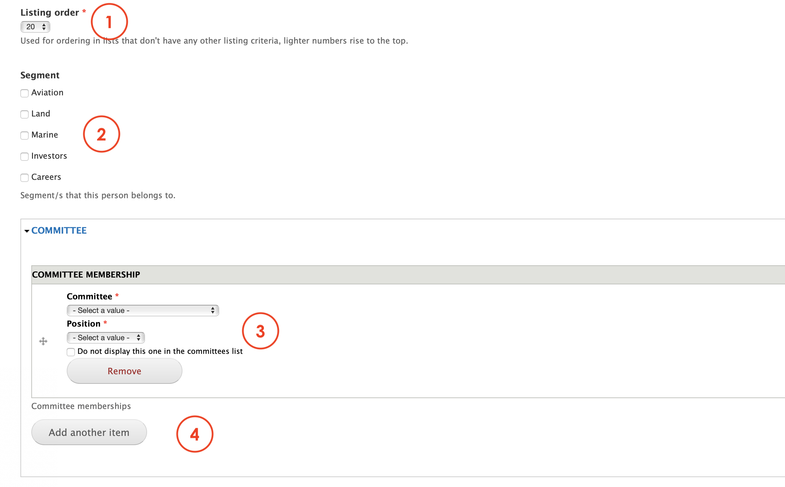
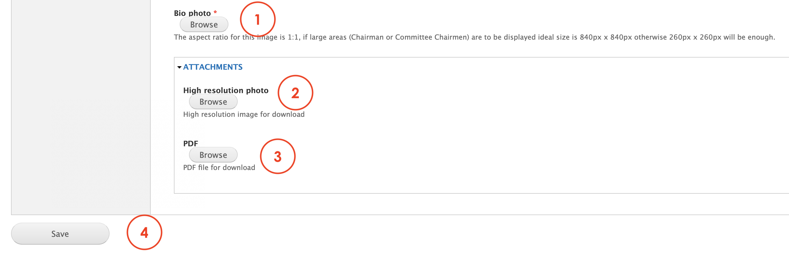

# Corporate bio

Corporate Bio is the content type that Editors must use in order to create each a person's profile or bio. This page's layout features: 

1. A photo profile
2. A name's person
3. A title in the company
4. A description

Besides the page, this content type generates the content needed when using [Bio Listing paragraph](../paragraphs/bio-listing.md). 

You can find an example of this content type here: [https://www.msts.com/en/brandon-spear](https://www.msts.com/en/brandon-spear)

## **Step-by-step guide**

To create this content type, select **Content**=&gt; **Add Content**=&gt; **Corporate bio** like in the image below:

You'll should be able to see a form like this:

1. **Internal name**: Is the name that you use to indentify this node.
2. **Hero Area**: allows Editors to add a Hero banner to the page. To know how to create a hero banner [click here](../paragraphs/hero-banner.md). 
3. **Full name**: enter the person's full name here
4. **Last name**: enter the person's last name here
5. **Company name**: enter company's name here. E.g.: MSTS
6. **Job Title**: enter the charge of the person here
7. **Position type**: select one of the available positions if required. 

Scroll down on the page to see more options:

1. **Listing order**: allows Editors to set the level of importance for this profile. 1 is the highest, 
2. **Segment**: select one of the segments available if needed.
3. **Committe**: select a committe and position from the dropdown menu if applies. 
4. **Add anoter item**: add another committee if the person is attached to more than one. 

Scroll down the page to see more options:

Scroll down the page to see more options:

1. **Bio photo**: add the photo you want to use for this profile. 
2. **Hight resolution photo**: allows Editors to upload a high resolution image for this profile that can be downladable. 
3. **PDF**: allows Editors to upload a pdf document that can be downloaded bu the Users

