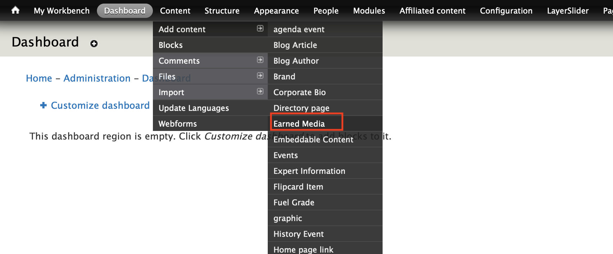
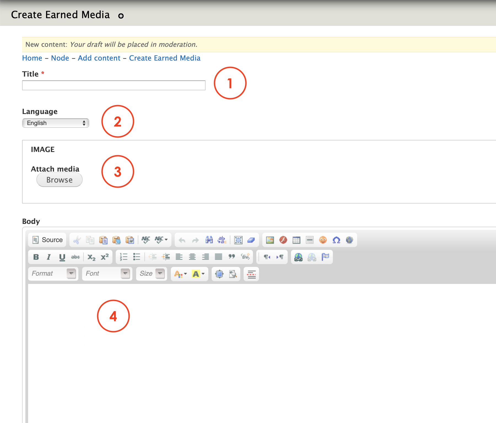
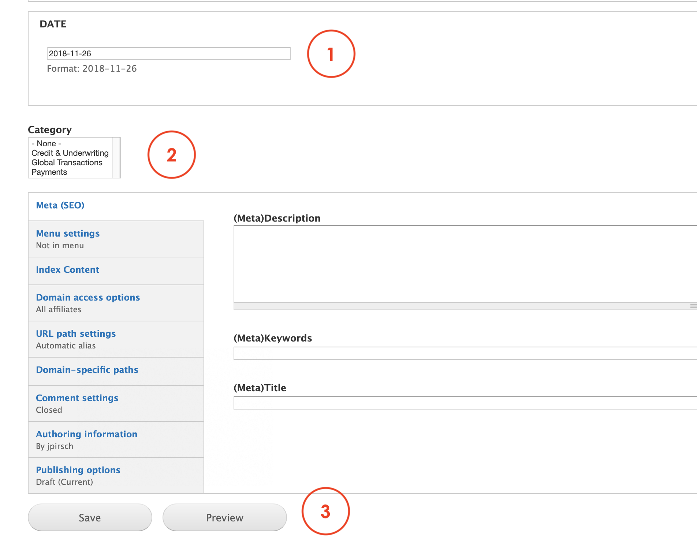

# Earned media

**Earned Media** content type allows Editors to create news content layout pages featuring:

1. An image
2. A date
3. A title
4. A description

The paragraph has also a feature that allow Users to share the article by using social nerworks. 

This content type creates a page itself but is also the content that we need when using columns paragraph to display latests news or news views. 

You can find an example of this content type here: [https://www.msts.com/](https://www.msts.com/en/earned-media/paythink-international-payments-have-lots-tech-rules-are-stuck-past)

## **Step-by-step guide**

To create this content type, select **Content**=&gt; **Add Content**=&gt; **Earned media** like in the image below:

You should be able to see a form like this:

1. **Title**: add a title for the news or article
2. **Language**: select the language
3. **Image**: lets Editors to browse and choose an image from their PC, the internet or the images preloaded on the website. 
4. **Body**: add the text and content you want to display in the news. You can use the editor for formatting purposes. 

Scroll down to see more options:

1. **Date**: add a date for the news or article. Double check that you're using the right format. 
2. **Category**: select an available category from the list if required. 
3. **Save / preview**: to save the content type and preview. 

