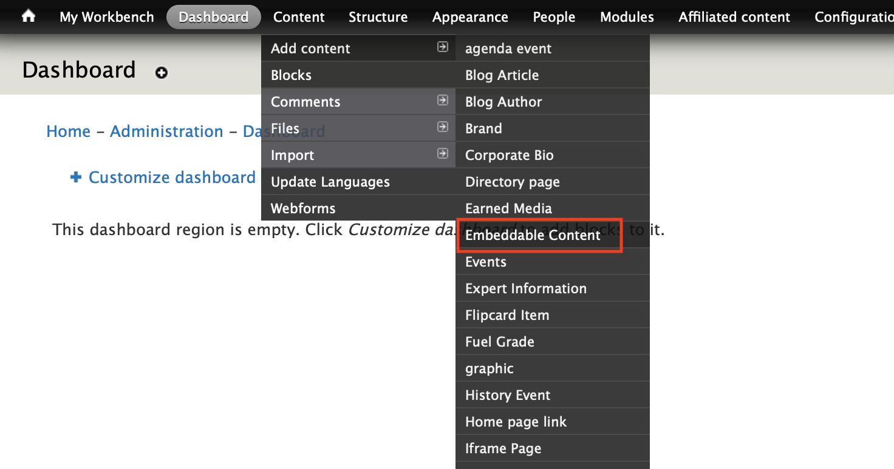
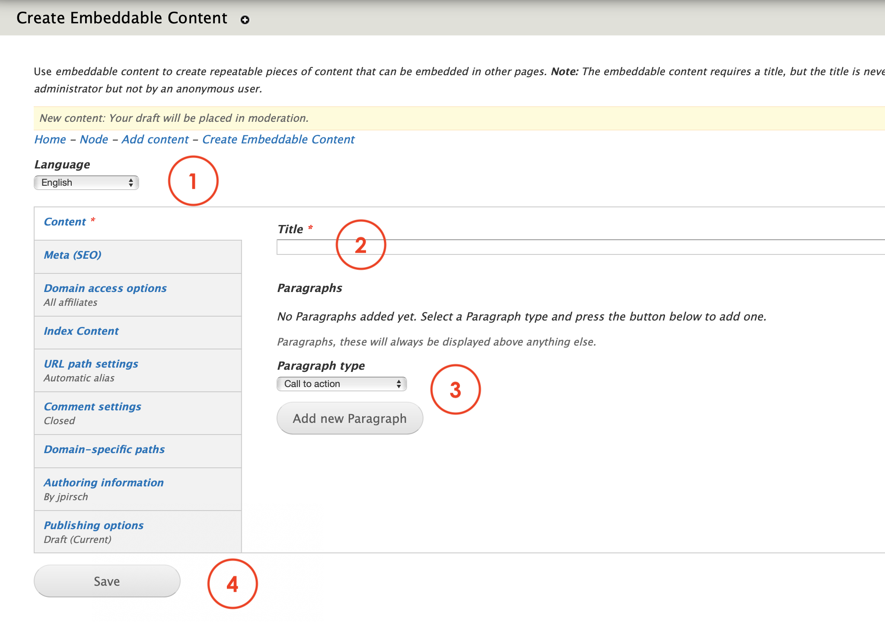
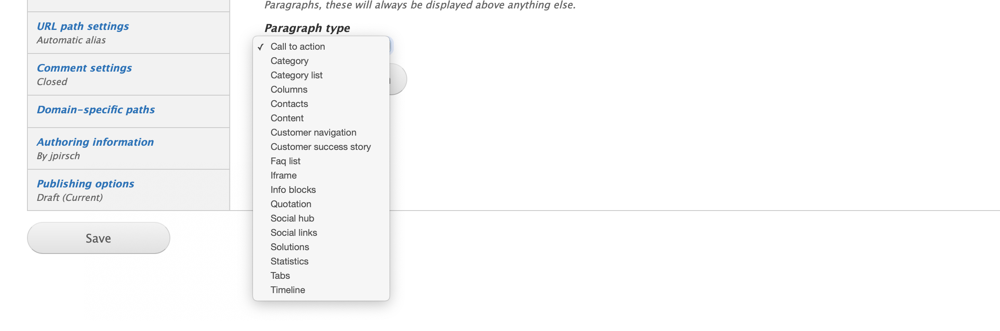

# Embeddable content

Use **Embeddable content** to create repeatable pieces of content that can be embedded in other pages. **Note:** The embeddable content requires a title, but the title is never displayed when embedded, also the embeddable content can be viewed directly as a page by an administrator but not by an anonymous user.

## **Step-by-step guide**

To create this content type, select **Content**=&gt; **Add Content**=&gt; **Embeddable content** like in the image below:

You should be able to see a form like this:

1. **Language**: select the language of the content you're working on. 
2. **Title**: add a title for this content type
3. **Parapraph type**: select from the dropdown menu the paragraphs available for this content type

  4.    **Save**: press save draft, save to review or publish.

