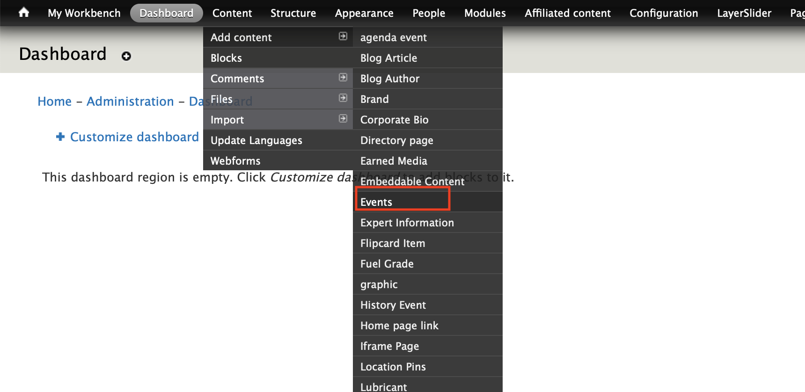
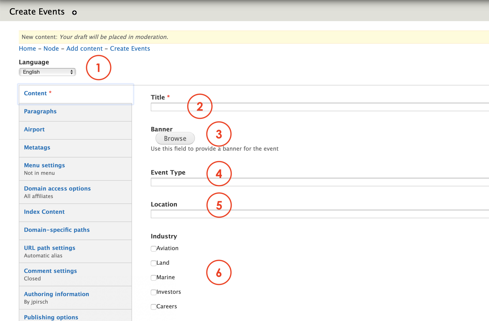
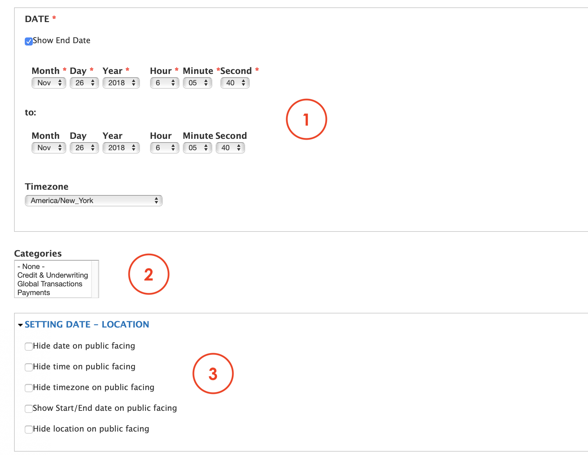

# Events

**Events** is the content type we use to create an event page. The information contained on this page allows the platform to correctly display the events in many views. 

Events features:

* An Image
* A date
* A title
* A description

You can find an example of this content type here: [https://www.msts.com/](https://www.msts.com/en/events/webinar-driving-loyalty-through-payments-how-smart-b2b-companies-drive-sales-through-5-star)

## **Step-by-step guide**

To create this content type, select **Content**=&gt; **Add Content**=&gt; **Events** like in the image below:

You should able to see a form like this: 

1. **Language**: select the language
2. **Title**: add a title for the news or article
3. **Banner**: use this option to browse and upload an image as a banner for the event. 
4. **Event Type**: select form the list
5. **Location**: add a location as reference only. The full location information will required ahead the page.
6. **Industry**: select one of the industries if required.

