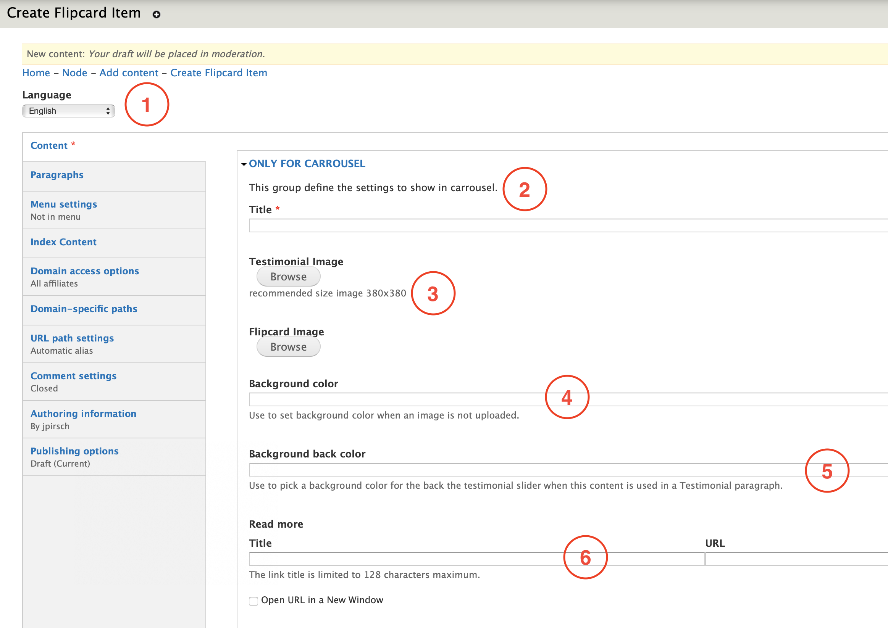

# Flipcard item

**Flipcard item** is the content type Editors must use in order to create the items that will be use for the [**Flipcard paragraph**](../paragraphs/flipcard.md). 

The flipcard item is composed by two sides, like a fliping card featuring an image and a title and in the reverse a description. 

The flipcard behavior is set per default.

You can find an example of this content type here: [https://www.msts.com/](https://www.msts.com/en)

## **Step-by-step guide**

To create this content type, select **Content**=&gt; **Add Content**=&gt; **Flipcard Item** like in the image below:

  
You should be able to see a form like this:

