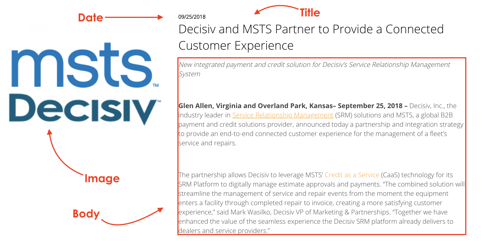
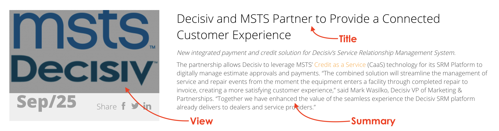
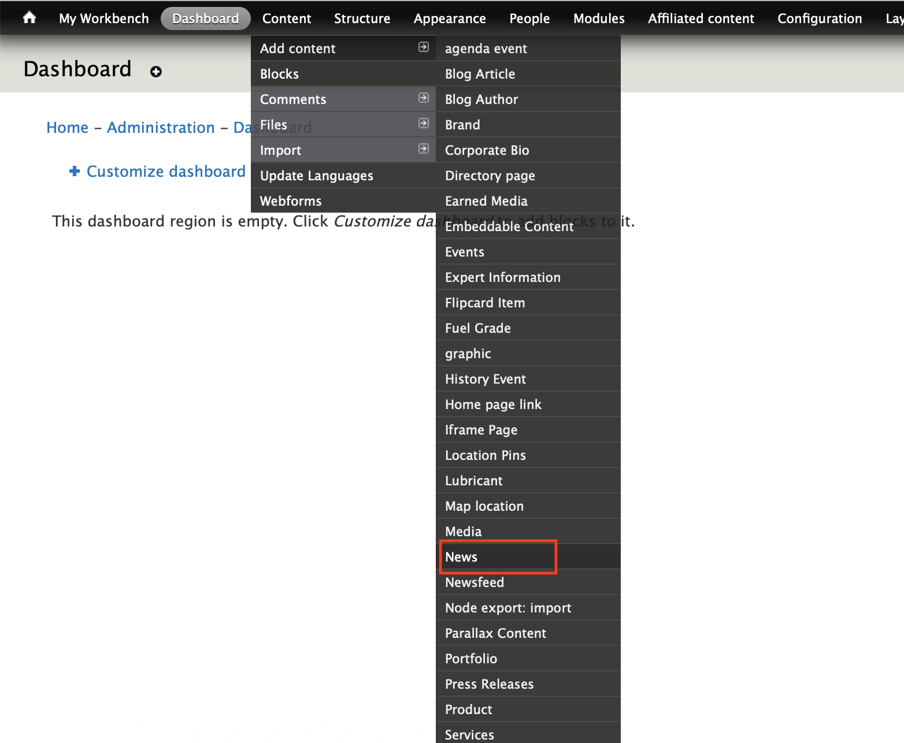
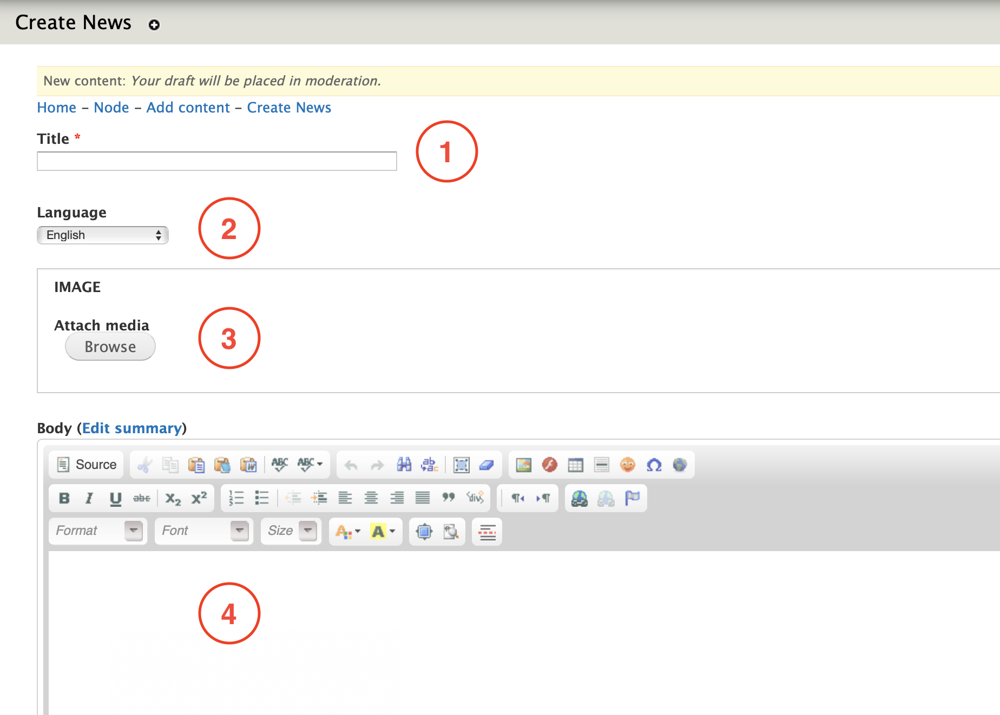
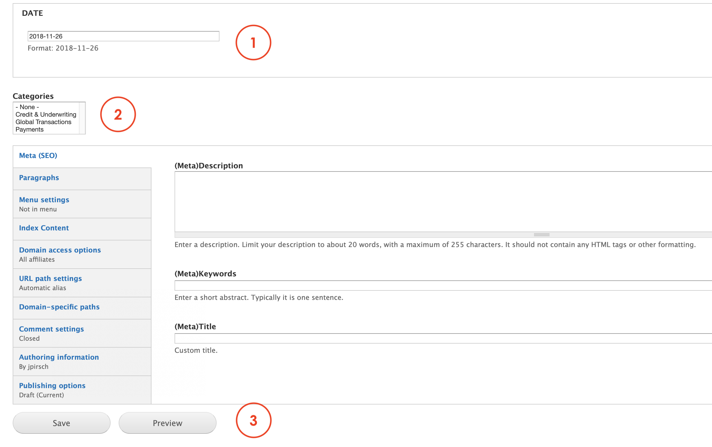

# News

**News** is the content type we use to create news articles in a specific layout and format that can be reuse in multiple paragraphs and views. 

When you create News with this content type, you actually create a page that looks like this:

At the same time, we can use a paragraph like Embedded Views content or a Latests news view to showcase a preview of this information in a different page. This option looks like this:

An example of this use can be found here: [https://www.msts.com/en/msts-news](https://www.msts.com/en/msts-news)

## **Step-by-step guide**

To create this content type, select **Content**=&gt; **Add Content**=&gt;  **News**  like in the image below:

You should be able to see a form like this:

  

