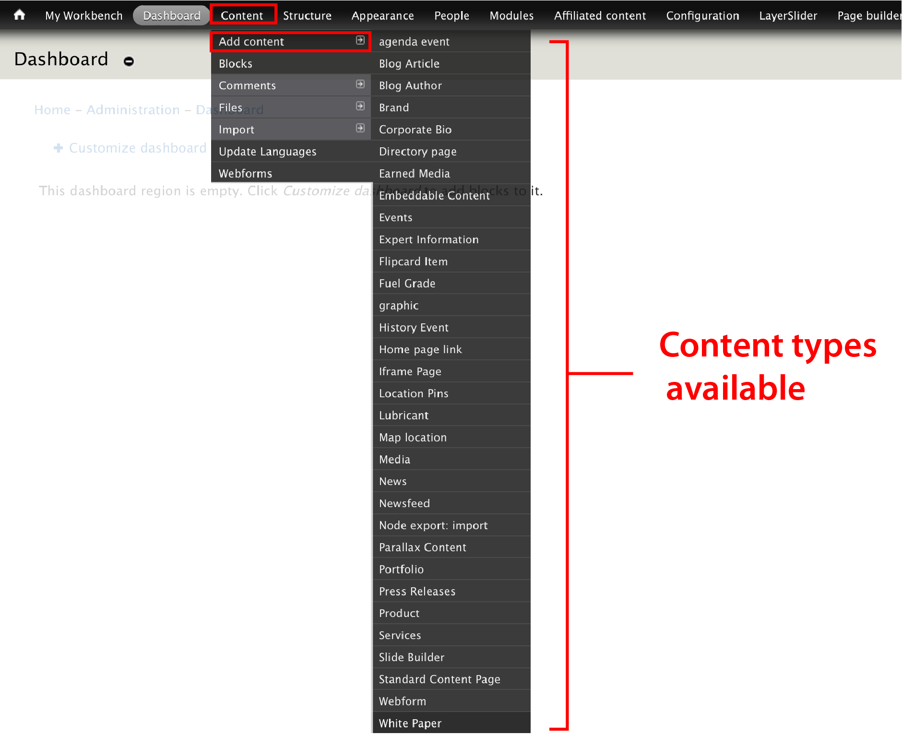
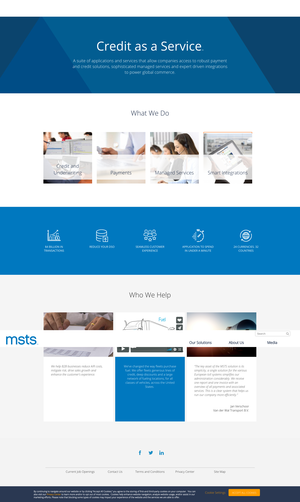

# Content Types

#### In order to properly add content to Kinect Energy website, you must first understand how its content has been arranged.  

This is what we call **Content Types**.

Before adding content, make sure to identify the right type of content you want to create. These are the most used content types are the ones we are going to describe in this document:

* **Standard Content page**
* **Complete the list ....**

To access to these content types, you must select **Content** followed by **Add Content** and choose one from the list. 

Here's a guide for the **Content types** we use on MSTS:

## Standard content page

It's the most used content type. The Standard Content **allows editors to build a page by adding components or paragraphs**. 

## Corporate bio

## Earned media

## Events

## Flipcard item

## Location pins

## Map location

## Media

## News

## Node export import

## Parallax content

