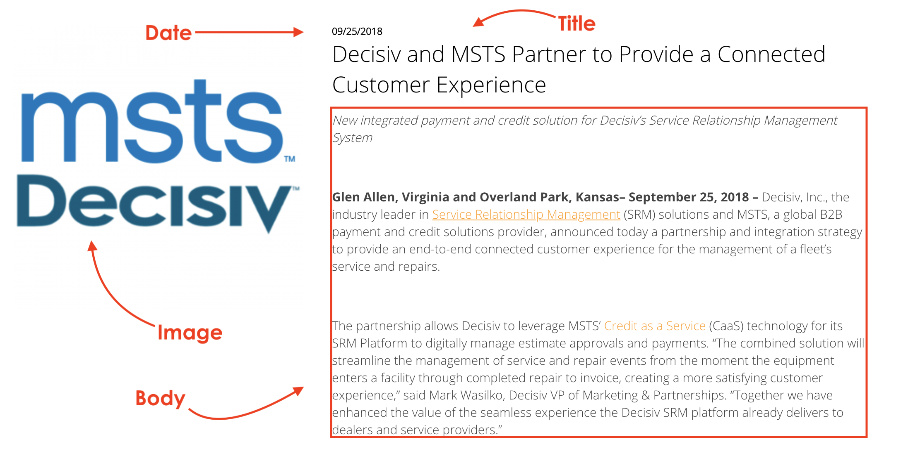

# Content Types

#### In order to properly add content to Kinect Energy website, you must first understand how its content has been arranged.  

This is what we call **Content Types**.

Before adding content, make sure to identify the right type of content you want to create. **We're going to review the paragraphs used is MSTS site ONLY:**

* \*\*\*\*[**Standard Content page**](content-types-1/standard-content-page.md)\*\*\*\*
* \*\*\*\*[**Corporate bio**](content-types-1/corporate-bio.md)\*\*\*\*
* \*\*\*\*[**Earned media**](content-types-1/earned-media.md)\*\*\*\*
* \*\*\*\*[**Events**](content-types-1/events.md)\*\*\*\*
* \*\*\*\*[**Flipcard item**](content-types-1/flipcard-item.md)\*\*\*\*
* \*\*\*\*[**Map Location**](content-types-1/map-location.md)\*\*\*\*
* \*\*\*\*[**News**](content-types-1/news.md)\*\*\*\*

To access to these content types, you must select **Content** followed by **Add Content** and choose one from the list. 

Here's a guide for the **Content types** we use on MSTS:

## Standard content page

It's the most used content type. The Standard Content **allows editors to build a page by adding components or paragraphs**. 

## Corporate bio

## Earned media

## Events

## Flipcard item

## Map location

It's the information that allows the system to place a location in a map.

## News

## 

