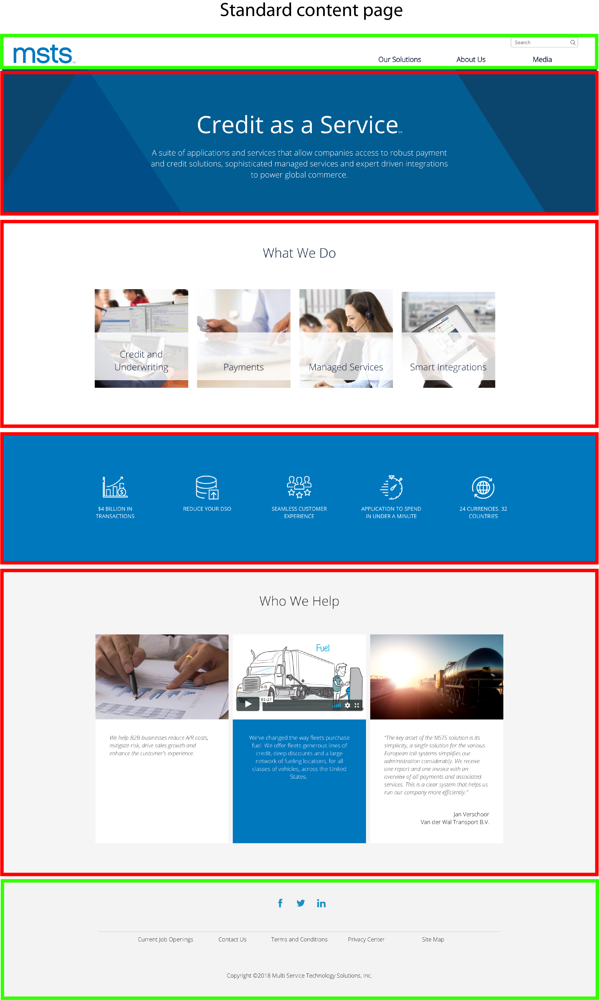

# General information

So far, we have seen the different content types and paragraphs available in MSTS site. Now it's time to learn more about how we can put them together in order to create a page.

We're going to give you graphic examples using the most common templates found in MSTS site. We'll show you the first steps required to create a page from scratch.

Remember, this is the structure of the page, it means that we'll show you how to choose and use paragraphs and content types, but you'll also requested to read the entire document to fully understand how to create each one of those paragraphs and content types.

## **Standard Content Page**  

**Standard Content page** is the content type we use **to create a page.**

Take the homepage as an example. Below, you can see the homepage layout which has been created using the Standard content page.

Highlighted in **green,** you can see the components that are already preloaded in the template: _header, menu, footer and bottom footer_. This means that when creating a page, Editors have to focus on the content only, which is highlighted in **red.**

We're going to review some of the most used templates in MSTS site, and see how the have been created. 

