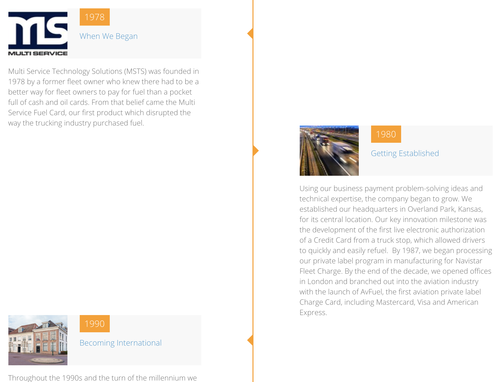

# Paragraphs available on MSTS \(quick look\)

Here's a quick look on all paragraphs available on Kinect Energy site:

For each one, you'll find a walkthrough that will help you, as an editor, to create, modify and publish content meeting the standards set for this website.

## Hero banner

It's not a properly a paragraph but a functionality that most content types and paragraphs can have. [Click here](paragraphs/hero-banner.md) to see the full explanation. 

## Bio listing

## Columns

## Content

## Content quote

## Embedded components

## Embedded views content

## Flipcard

## Iframe

## Info blocks

## Logo grid

## Map location

## MSTS timeline

## Multiple columns

## Scrollable images

## Statistics

## Tabs

## Two column content

