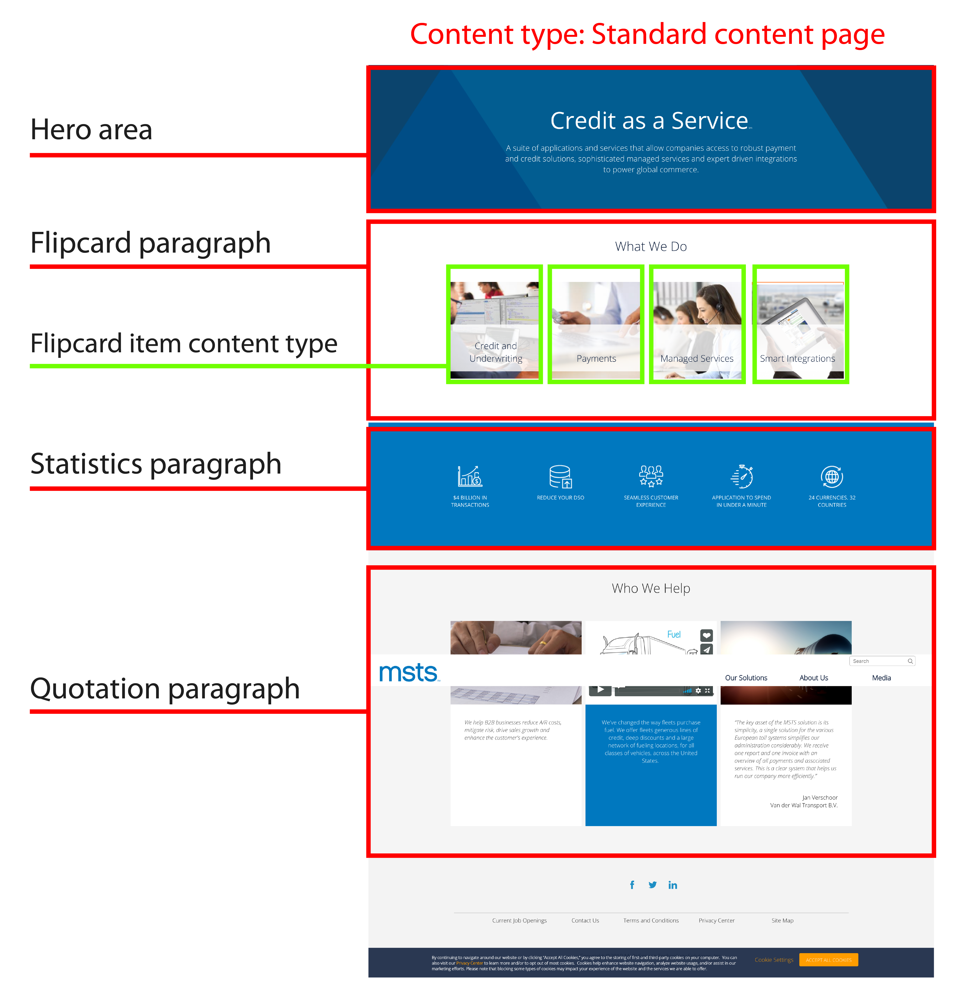

# Paragraphs - introduction and how to use them

MSTS site uses Drupal **Paragraphs** feature as one of the main way to create, edit and present content throughout the site. It gives more editing power to editors: instead of putting all their content in one WYSIWYG body field including images and videos, end-users can now choose on-the-fly between pre-defined Paragraph Types independent from one another.

Paragraphs are included into some content types that have the paragraph field included \(Homepage / Standard Content Page, etc\) and allows Editors to create unique and versatile pages very easily. A good example of a Content Type that supports paragraphs is Standard Content Page, which is by the way, the main Content type used to create the pages found on msts.com domain.  Users are allowed to add as many paragraphs as they need into a page, putting one or several paragraph types together.

Each paragraph created for MSTS site supports one or several particular features, that is both visual and functional, such as: carousel, images slider, timeline, statistics content, quotes, etc.

This document is a step-by-step guide that meant to help and guide editors throughout the process of creating a new page, adding paragraphs and so on.

### How to use paragraphs 

Imagine the actual website as a structure filled with different types of paragraphs. As an editor, you can choose which paragraphs fits better for the type of content you're willing to display.

Here's an example of how editors used paragraphs and content types to create a basic homepage with the structure of MSTS site:

The red blocks are the **paragraphs** added to this page. These **paragraphs** can be formed by **components** or **items**. As an example, **Flipcard** is a paragraph composed by 4 **Flipcard** **Items \(content type\)** that are nested inside this paragraph. This means that you have to create first the content type named Flipcard and then create the Flipcard paragraph to view the items you've created. 

