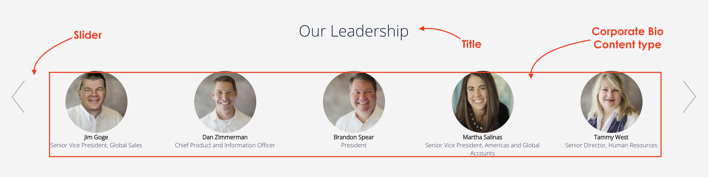
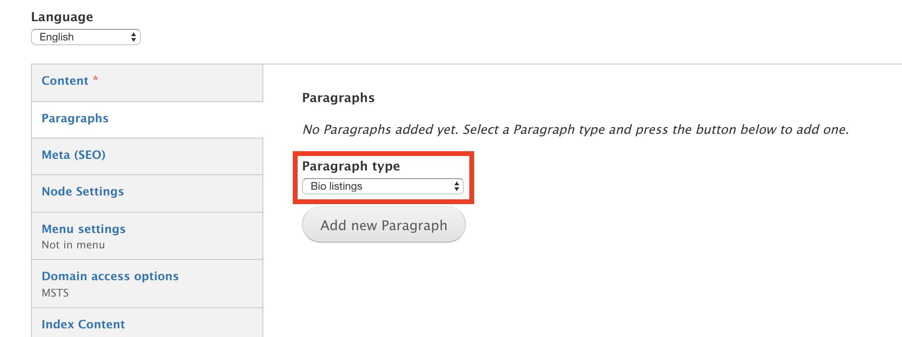
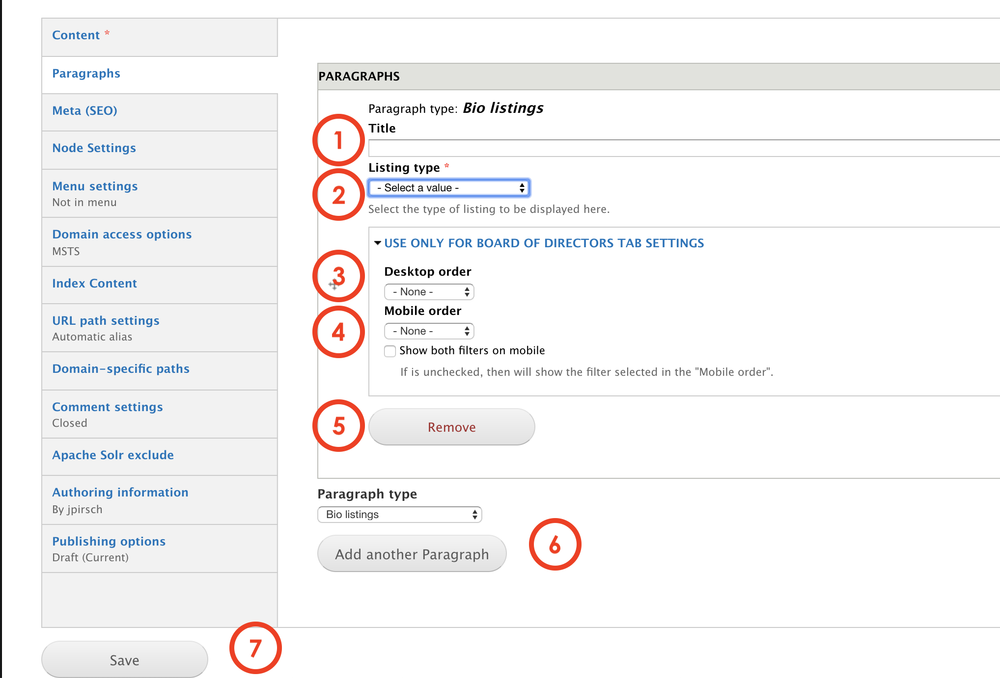

# Bio listing

The **Bio listing** paragraph allows editors to create a section in a page to display a group of people within the organization in a profile mode. This paragraph can be used to present board members, seniors and leaders among others. 

This paragraph is a wrap. This means that it's a paragraph that works as a viewer to display pieces of content that were previously created. The content you get to see in the paragraph was created using the [Corporate Bio content type](../content-types-1/corporate-bio.md). Bio listing takes the profiles or bio created and wrap them together in a specific layout. 

The default display is 5 profiles per page. The others will be accesible by horizontal scrolling. 

## Content types

This paragraph can be used within the following content types:

* Standard content page

Currently you can see this paragraph used within MSTS site homepage here: [https://www.msts.com](https://www.msts.com/en/about-us)

## Step-by-step guide 

To create a **Bio Listing** Paragraph, select **Content** =&gt; **Add Content** =&gt; **Standard Content Page** \(or any other content type that includes this paragraph \).

You will be headed to Standard Content Page form. The first thing you will need to do is adding a new paragraph. Select **Bio Listing** from the dropdown menu and then, click on **Add new Paragraph:**

**Bio Listing** paragraph form should look like this:

1. **Title**: is the title that will be on top of the items and visible for users. 
2. **Listing type:** select the category you want to list. This is what will link this paragraph to the content that you have created with the Corporate bio content type.
3. **Desktop order:** allows editors to customize the way the reults will be sorted and displayed in desktop viewports. 
4. Mobile order: allows editors to customize the way the reults will be sorted and displayed in mobile viewports. 
5. **Remove:** click on _Remove_ to erase the paragraph.
6. **Paragraph type**: you can select another paragraph from the dropdown menu that will be displayed below the **Bio listing** paragraph. Click _add_  to create.
7. **Save**: now, all you have to do is to save and preview changes or save for review. 

\*\*\*\*

