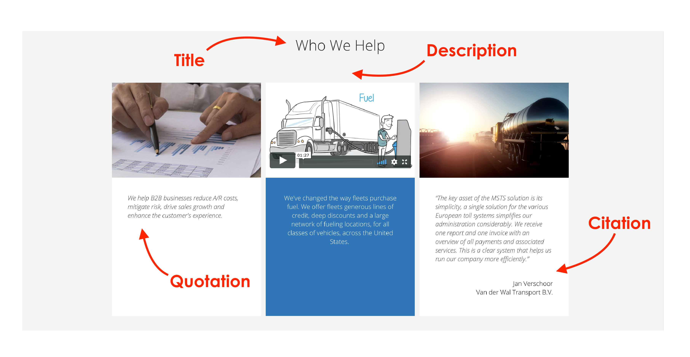
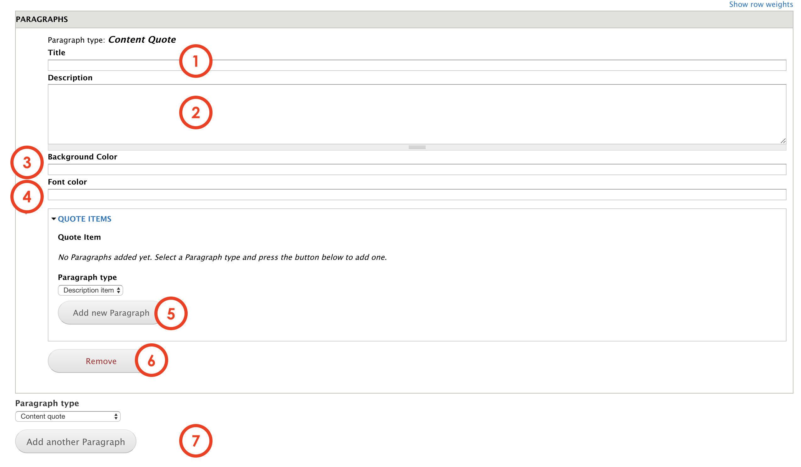
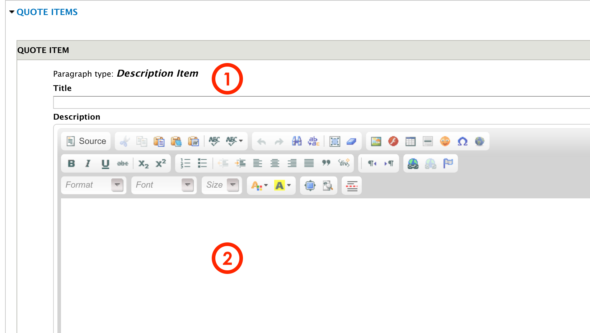
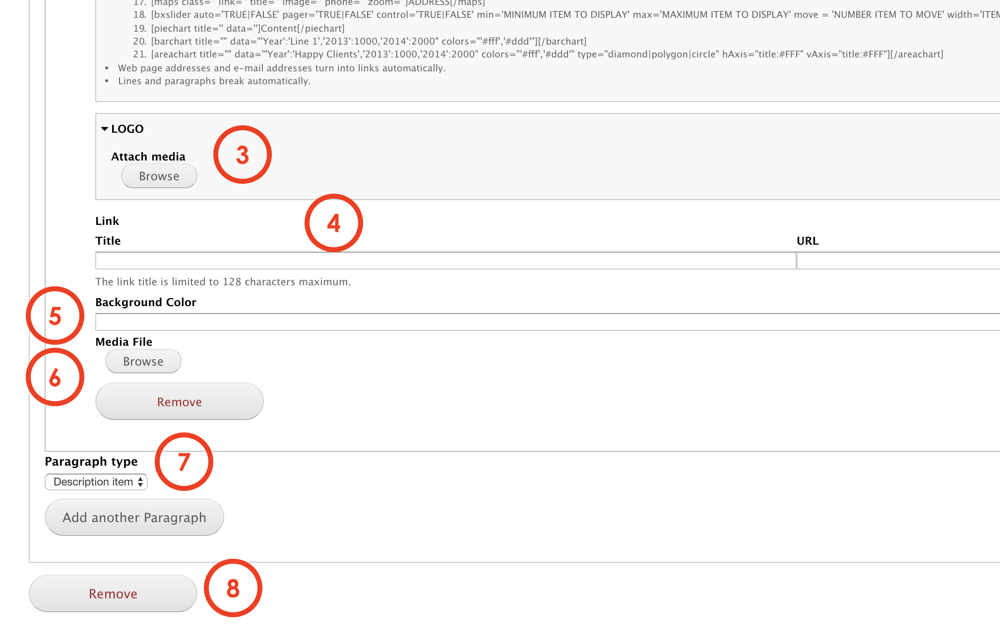
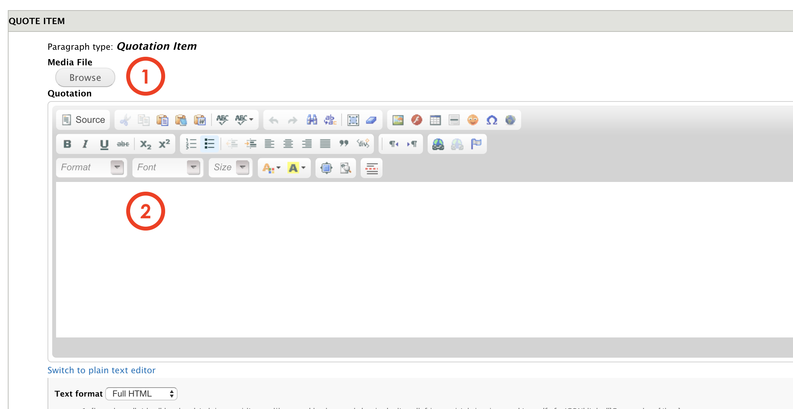
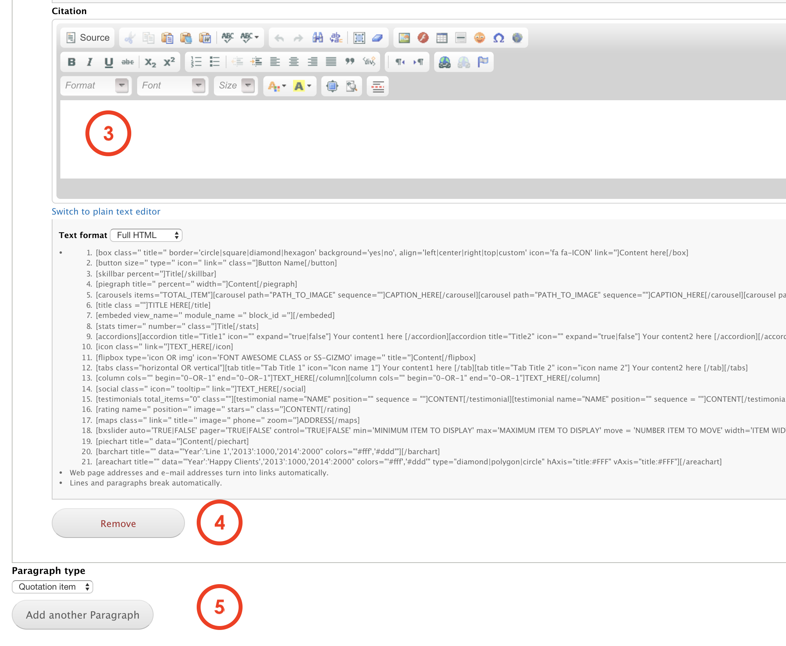

# Content quote

The **Content quote** paragraph allows editors to add one or several blocks of content with a quotation format. Editors can chose the media content displayed between video or image, add the quote and the citation. When displaying the component, they will be arranged and aligned.

## Content types

This paragraph can be used within the following content types:

* Standard content page

Currently you can see this paragraph used within MSTS site homepage here: https://www.msts.com

## Step-by-step guide 

To create a **Content quote** Paragraph, select **Content** =&gt; **Add Content** =&gt; **Standard Content Page** \(or any other content type that includes this paragraph \).

You will be headed to Standard Content Page form. The first thing you will need to do is adding a new paragraph. Select **Content Quote** from the dropdown menu and then, click on **Add new Paragraph:**

**Content Quote** paragraph form should look like this:

1. **Title**: is the title that will be on top of the items and visible for users. 
2. **Description:** add a description text that will be placed below the title.
3. **Background color:** set the color that will be behind the text.
4. **Font color:** set a font color.
5. **Paragraph type**: this refers to the Item itself. You can select wether _Description Item_ or _Quotation Item._ Once selected press _Add new Paragraph_. 
6. **Remove:** click on _Remove_ to erase the paragraph.
7. **Paragraph type**: you can select another paragraph from the dropdown menu that will be displayed below the _Content quote_ paragraph. Click _add_  to create.

## Quote items

You can create type of content items: **Description item** or **Quotation Item**. These are paragraph that are nested inside the quote items. 

### Description Item

This paragraph features: 

* Image \(or color background\)
* A title with a background filter to highlight the text 
* A description

The Description item form should look like this:

1. **Title:** Add Item's title. This title will be displayed with a filter in the back.
2. **Description:** Add a description. 

3. **Logo:** add a logo \(confirm\)  
4. **Link**: you can add a link to open an external page. Add a title for this link and the URL where users will be taken to.   
5. **Background** **color**: allows editors to select a background color that will be place instead of an image  
6. **Media** **file**: allows editors to select an image that will be used for the item   
7. **Paragraph type**: you can select another paragraph from the dropdown menu that will be displayed below the Content quote paragraph. Once selected, press on **Add another paragraph** to add it.  
8. **Remove**: by pressing remove, the paragraph you have created will be deleted. 

### Quotation Item

This item features:

* An image, video or background color 
* A quotation or description
* A citation

The Quotation item form should look like this:

1. **Media** **file**: select the file you want to use for this item. It can be an image or video.
2. **Quotation**: type in the text you want to use for this item.

3. **Citation**: add the person's name related to the quotation  
4. **Remove**: this action will delete this item  
5. **Paragraph type**: you can select another paragraph from the dropdown menu that will be displayed below the Content quote paragraph. Once selected, press on **Add another paragraph** to add it.

Now, all you have to do is to save and preview changes or save for review. 

