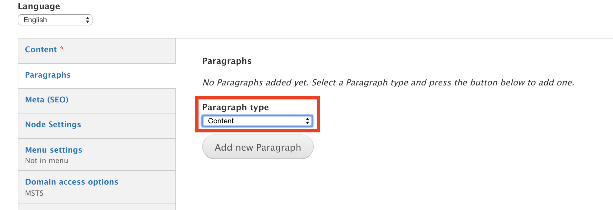
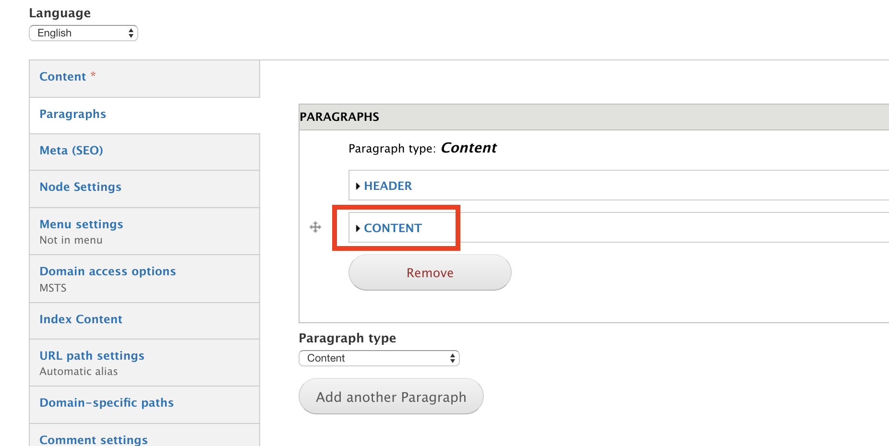
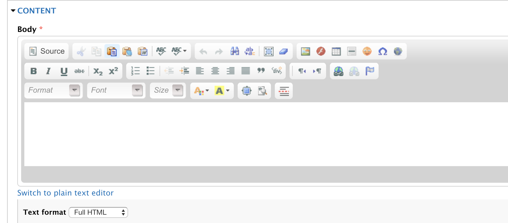
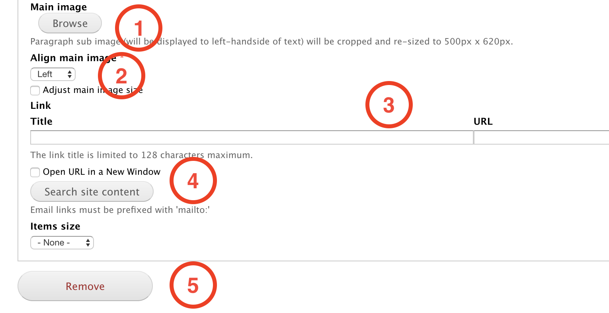

# Content

The **Content** paragraph allows editors to create a component that can be used as a section in a page. It can be as simple as a title or more complete by using an image.

## Content types

This paragraph can be used within the following content types:

* Standard content page

Currently you can see this paragraph used within MSTS site homepage here: [https://www.msts.com](https://www.msts.com/en/our-solutions)

## Step-by-step guide 

To create a **Content** Paragraph, select **Content** =&gt; **Add Content** =&gt; **Standard Content Page** \(or any other content type that includes this paragraph \).

You will be headed to Standard Content Page form. The first thing you will need to do is adding a new paragraph. Select **Content** from the dropdown menu and then, click on **Add new Paragraph:**

**Content** paragraph form should look like this:

**Open the tab content** 

Add the content by using the text field / WISIWYG editor

1. **Main Image**: browse for an image if needed. 
2. **Align main image:** select the option for the image alignment from left, center or right
3. **Link:** add a title / URL if you want to redirect users to an specific page or website.
4. **Open URL in a new Window**: will let users to open the link in a new window. 
5. **Remove:** click on _Remove_ to erase the paragraph.

Now, all you have to do is to save and preview changes or save for review. 

\*\*\*\*

