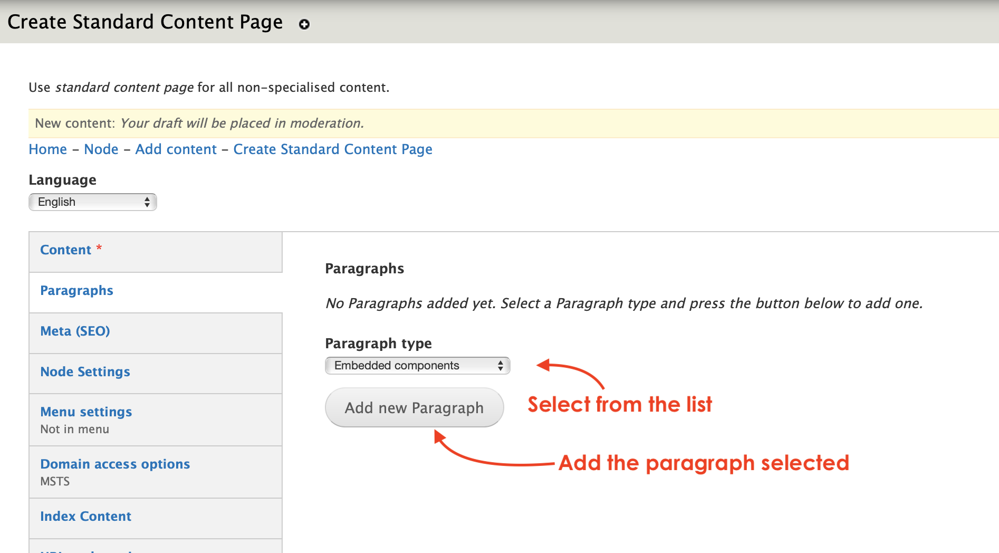
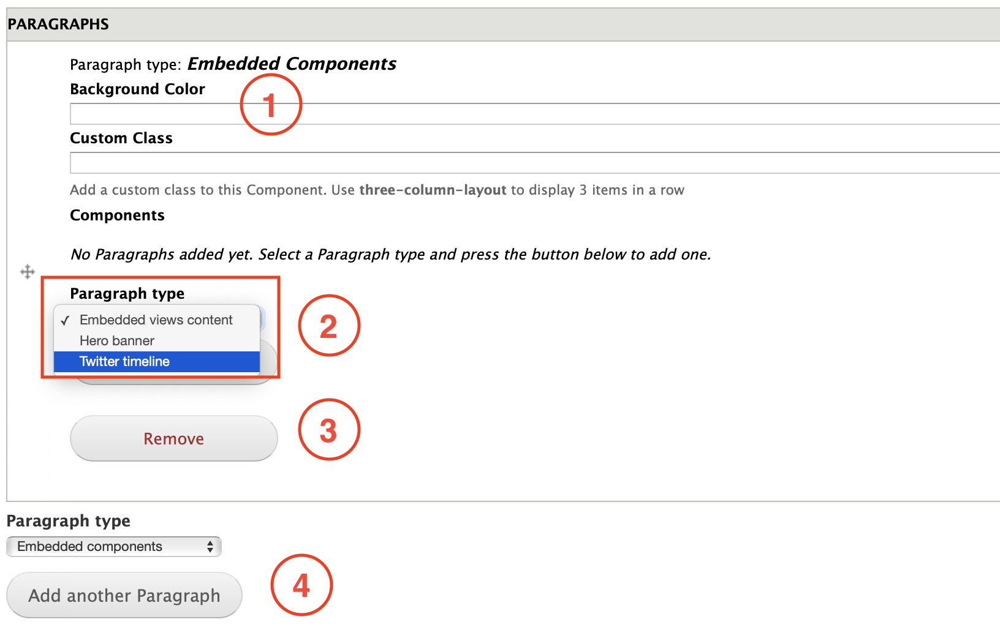
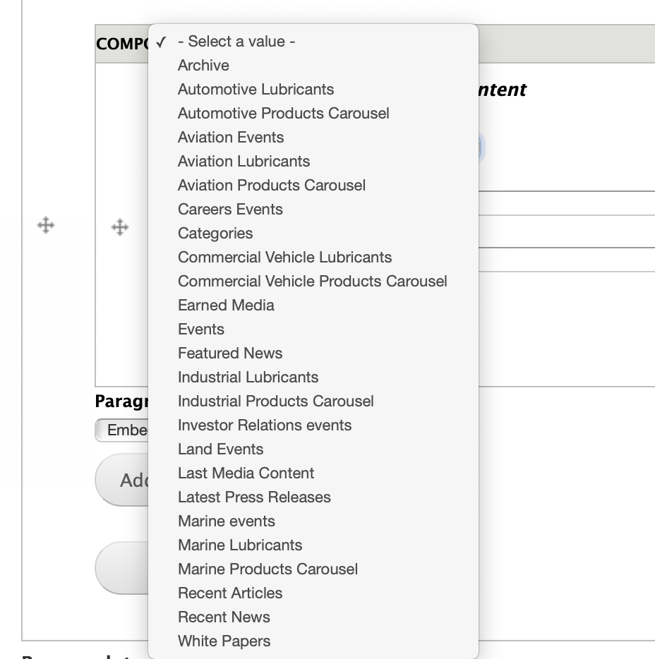
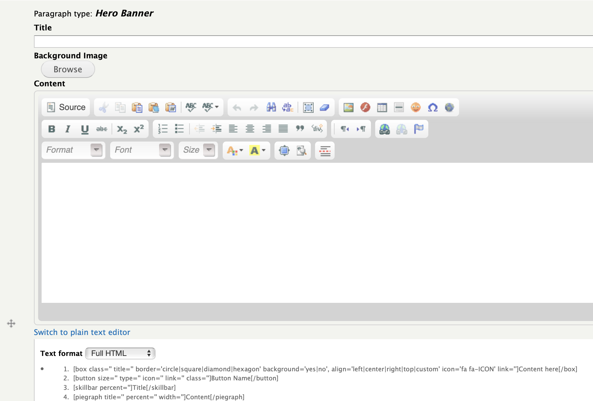
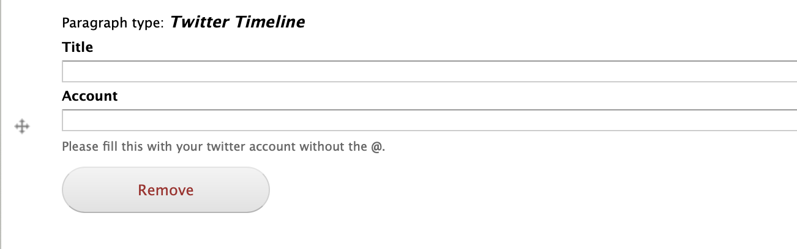

# Embedded components

**Embeddable components** allow Editors to showcase pieces of content created with the [**Embeddable content**](../content-types-1/embedded-content.md). The paragraph has a **three-column-layout** to display 3 items in a row per default. 

## Content types

This paragraph can be used within the following content types:

* Standard content page

Currently you can see this paragraph used within MSTS site homepage here: [https://www.msts.com](https://www.msts.com/en/media)

## Step-by-step guide 

To create a **Embedded components** Paragraph, select **Content** =&gt; **Add Content** =&gt; **Standard Content Page** \(or any other content type that includes this paragraph \).

 The first thing you will need to do is adding a new paragraph. Select **Embedded Components**  from the dropdown menu and then, click on **Add new Paragraph:**

**Embedded components** paragraph form should look like this:

1. **Background Color:** is a feature that allows Editors to custimize the background color. 
2. **Paragraph type**: this is the option that allows Editors to choose the paragraph view. 
3. **Remove**: click on _Remove_ to erase the paragraph.
4. **Add another paragraph**: allows Editors to add another paragraph to the page. This new paragraph will be displayed below the one that you have previously created. 

### Paragraph type available in Embedded components:

You can choose from: 

**Embedded views content**

Displays a list of Views content that you have already created using [Embeddable content](../content-types-1/embedded-content.md). What the Embedded view does is to take one of the categories you created and showcase its content. 

So, to resume: the paragraph Embedded Components is a wrap where you nest a Paragraph type to display the content. If you select the Embedded Views content, we'll get to see the categories and their content that you previously created. 

### Hero banner

Allows Editors to add the features of a hero banner inside a column like a title, a background image and a content by using the text field with the properties of a WYSIWYG editor.

### Twitter timeline

Allows Editors to link a twitter account that will work as a plugin nested in the page. 

