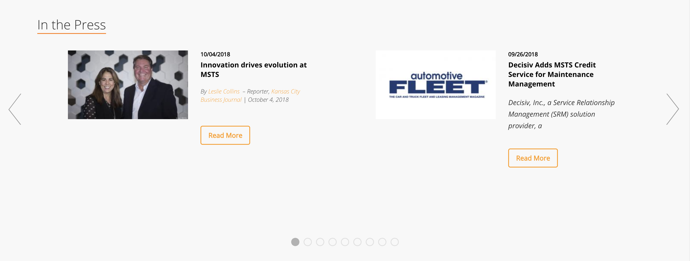
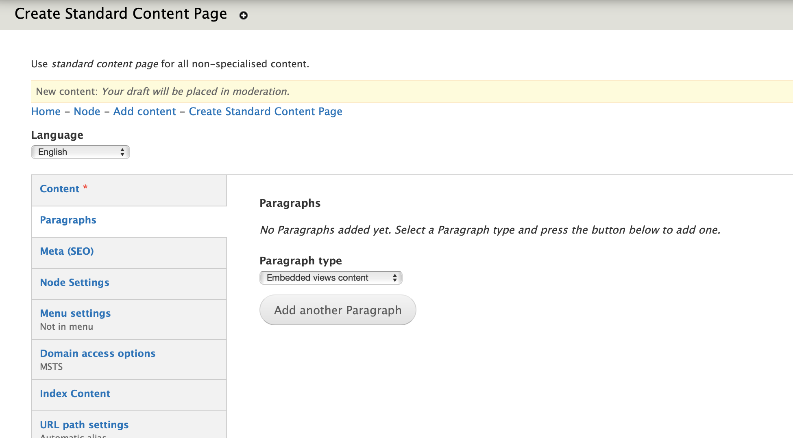
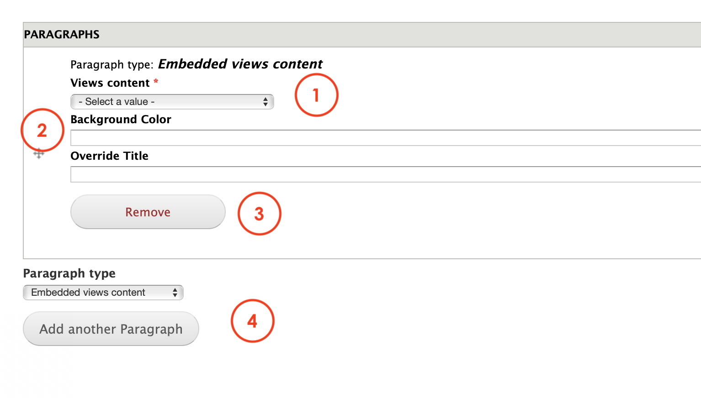

# Embedded views content

**Embedded views content** paragraph allows Editors to call out a view that has been created using [**Embeddable content**.](../content-types-1/embedded-content.md) 

These are different views for this paragraph:

## Content types 

This paragraph can be used within the following content types:

* Standard content page

Currently you can see this paragraph used within MSTS site homepage here: [https://www.msts.com](https://www.msts.com/en/about-us)​

## Step-by-step guide 

To create a **Embedded views content** Paragraph, select **Content** =&gt; **Add Content** =&gt; **Standard Content Page** \(or any other content type that includes this paragraph \).

You will be headed to Standard Content Page form. The first thing you will need to do is adding a new paragraph. Select  **Embedded views content** from the dropdown menu and then, click on **Add new Paragraph:**

**Embedded Views Content** paragraph form should look like this:

1. **Views content**: select from the list one of the available views. This is the content that will be showcased within the paragraph. Remember that this content is created using [Embeddable Content](../content-types-1/embedded-content.md).
2. **Background color and Override title:** Editors can customize background color and add an Override title**.** 
3. **Remove:** click on _Remove_ to erase the paragraph.
4. **Paragraph type**: you can select another paragraph from the dropdown menu that will be displayed below the **Embedded Views content** paragraph. Click _add_ to create.

