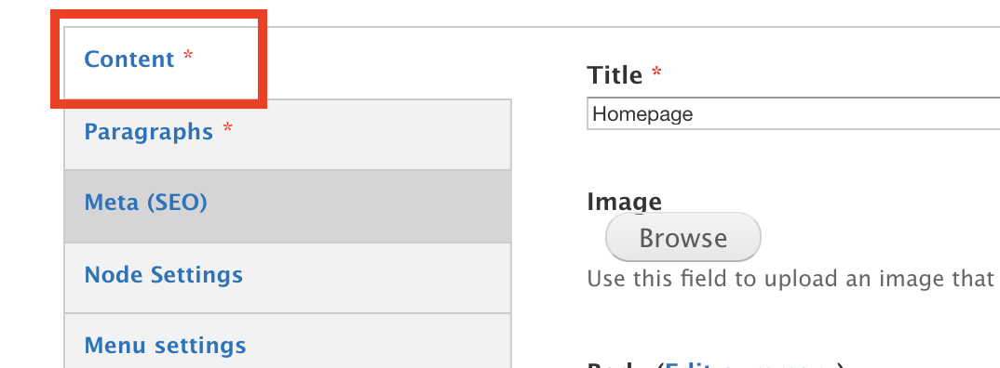
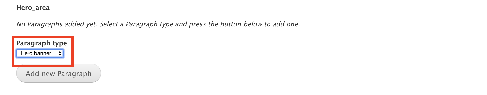
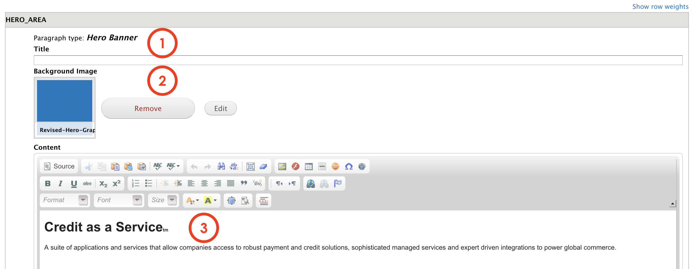

# Hero Banner

**Hero banner** is the first visual element a visitor encounters when opens the site or page.

It's a component which is already presented as an option in multiple paragraphs or content types, so you can choose whether use it or not while creating the page. 

## Content Types 

This paragraph can be used within the following content types: 

* Standard content page 

## Step-by-step guide 

Hero banner is a feature included on the Content itself, so in most cases you don't need top create a paragraph. All you have to do is check on the sidebar menu, like this:

Scroll down to see the Hero area. Here's where you can select the Hero Banner from the dropdown menu:

Once added, you should be able to see a form like this:

1. **Title**: add a title that will be visible to users
2. **Background** **image**: select the background that will be displayed on the Hero banner.
3. **Content**: is the description text that will be placed below the title. 

Then press save to preview, publish or review. 

