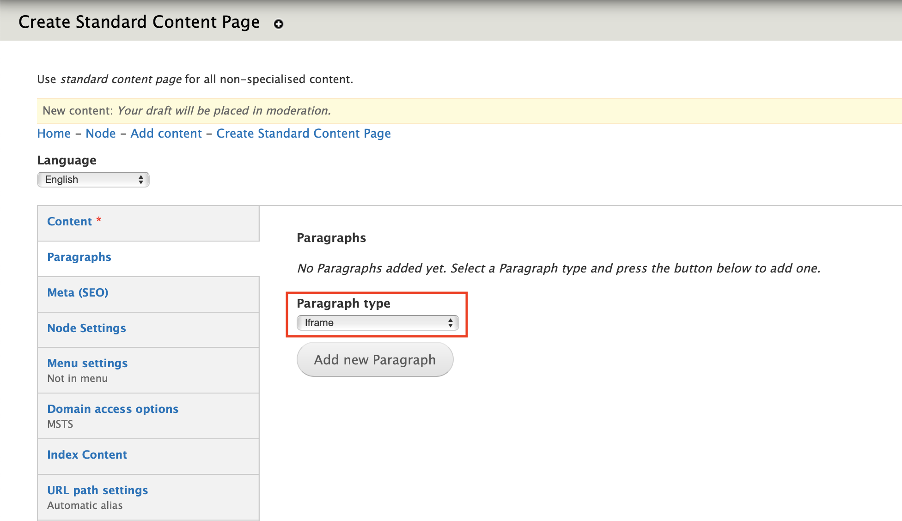
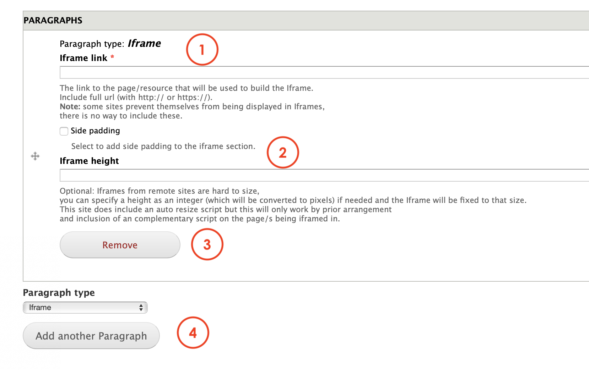

# Iframe

**Iframe** paragraph allows Editors to embed an HTML component in a page. The IFrame HTML element is often used to insert content from another source, such us an Eloqua form like in the below:  

## **Content types**

This paragraph can be used within the following content types:

* Standard content page

## **Step-by-step guide**

To create a **Iframe** Paragraph, select **Content**=&gt; **Add Content**=&gt; **Standard Content Page** \(or any other content type that includes this paragraph \).

Once in the Standard Content Page form, select **Iframe** from the dropdown menu and then, click on**Add new Paragraph:**

**Iframe** paragraph form should look like this:

1. **Iframe link**: here's where Editors must include the link they want to be embedded in the page.
2. **Iframe height**: allows Editors to customize the size of the iframe displayed. This feature requires some technical skills.
3. **Remove:** click on Remove to erase the paragraph.
4. **Paragraph type**: you can select another paragraph from the dropdown menu that will be displayed below the Content quote paragraph. Click add to create. 

Remember to save and preview changes or save for review.  

