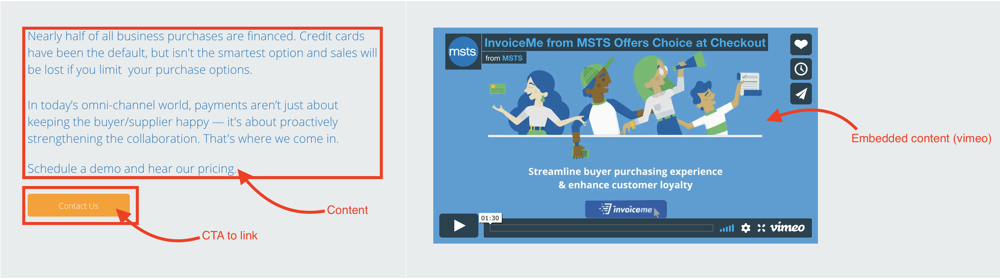

# Info blocks

The **Info blocks** paragraph allows Editors to create an element mixing CTA, text content and media files within the same paragraph. You can find this paragraph in: [https://www.msts.com/en/our-solutions](https://www.msts.com/en/our-solutions)

## Content Types 

This paragraph can be used within the following content types:

* Standard content page

Currently you can see this paragraph used within MSTS site homepage here:  [https://www.msts.com/en/our-solutions](https://www.msts.com/en/our-solutions)

## Step-by-step guide 

To create an **Info** **blocks** Paragraph, select Content =&gt; Add Content =&gt; Standard Content Page \(or any other content type that includes this paragraph \).

Select Info blocks and press **Add** **new** **Paragraph**. Once added, you'll be requested to **Add** **a new block**. 

  
Once added, you'll see a form like this:

Here's where Editors are able to create the two parts of the paragraph: **header** and **content**. 

### Header

Press header to see the form. It should look like this:

1. **Title**: add a title that will be displayed above the content. Title is optional. 
2. **Style**: define a text style from the options given on the dropdown menu.
3. **Width**: set a width for the title. For one word title you must select _Small titles._ 
4. **Content**: click to open the form for adding the content to the paragraph. 
5. **Remove**: this will delete the block you have created. 

### Content

Press Content to access a form like this. Add the content in the body.

Scroll down to see the rest of the options related to the **Call to action link**:

1. **Title**: add a title for the link. This is not visible to users. 
2. **URL**: add the url where the video is hosted. 
3. **Open** **URL in a new window**: select
4. **Light** **link** **style**: let Editors to customize the link style
5. **Remove**: this will delete the block you have created. 

Then press save to preview, publish or review. 

