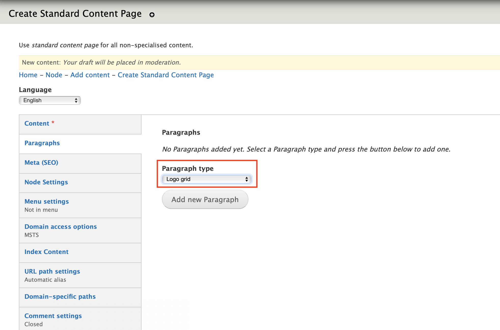
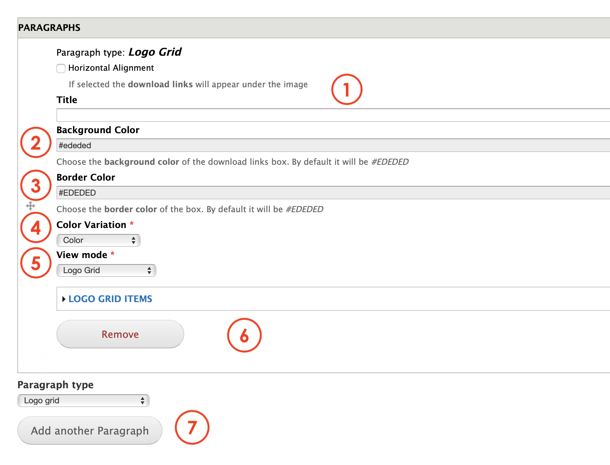
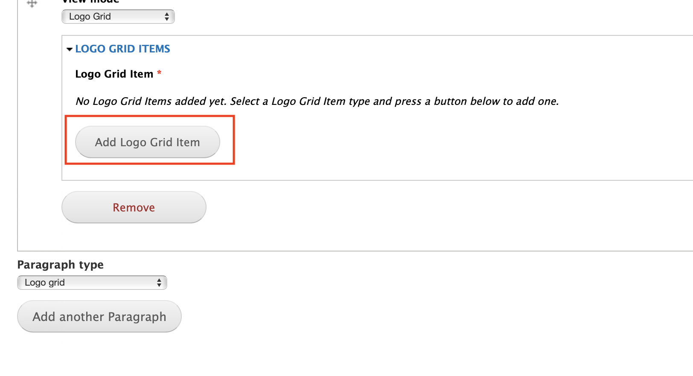
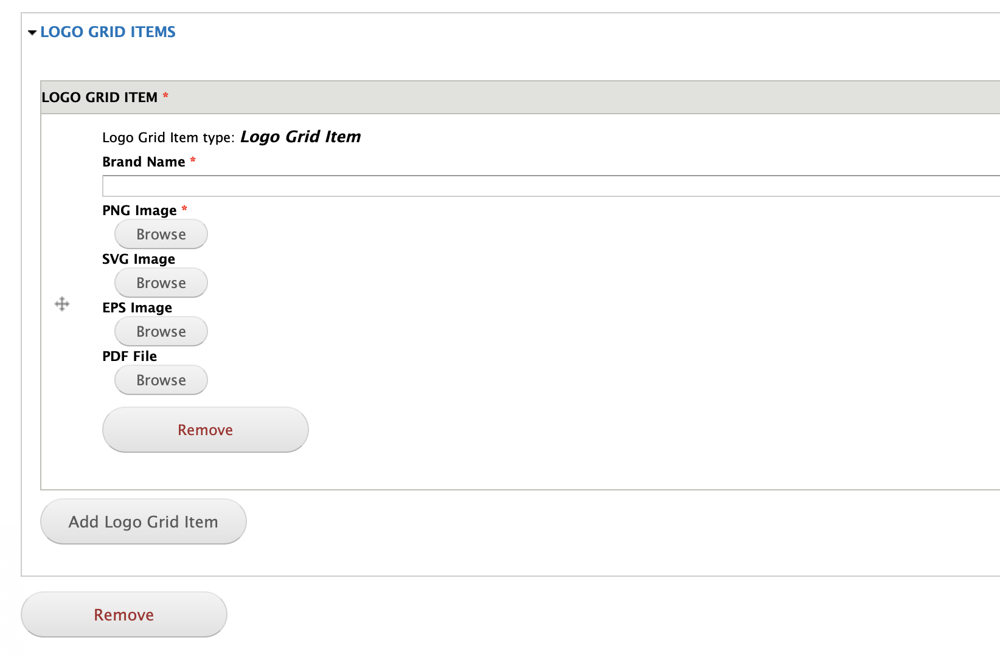

# Logo grid

**Logo grid** paragraph allows editors to create a section in a page to display logos. Usually this paragraph is used to showcase clients, partners or brands that are supported by our business.

## Content types

This paragraph can be used within the following content types:

* Standard content page

Currently you can see this paragraph used within MSTS site homepage here: [https://www.msts.com](https://www.msts.com/en/our-solutions)

## Step-by-step guide 

To create a **Logo Grid** Paragraph, select **Content** =&gt; **Add Content** =&gt; **Standard Content Page** \(or any other content type that includes this paragraph \).

You will be headed to Standard Content Page form. The first thing you will need to do is adding a new paragraph. Select **Logo grid** from the dropdown menu and then, click on **Add new Paragraph:**

**Logo grid** paragraph form should look like this:

1. **Title**: select a title that will open the paragraph
2. **Background Color**: allows Editors to customize the background color. 
3. **Border Color**: allows Editors to customize the border color. There's a value per default in case you don't want to assign one. 
4. **Color Variation**: let Editors to choose the color display mode, switching from Color, to grayscale or B/W.
5. **View mode**: allows Editors to choose from Logo grid or Download grid. 
6. **Remove**: this action will delete this item
7. **Paragraph type**: you can select another paragraph from the dropdown menu that will be displayed below the Content quote paragraph. Once selected, press on **Add another paragraph** to add it.

### Logo Grid Items 

Now that you have the "parent" paragraph, you need to create the items. Basically, this action consists on creating a card for each logo with some information that the platform requires. 

When clicking over **Logo grid items** tab, you'll get see a form like this:

Click on **Add Logo Grid Item** to acces a form to complete the operation: 

Now, as an Editor, you'll have to type the Brand's name and upload the files that corresponds to the logo on their respective format. Notice that a PNG is mandatory. 

You'll have to repeat this operation for each brand by clicking on **Add Logo Grid Item**. Once the Items have been created, click on Save. 

