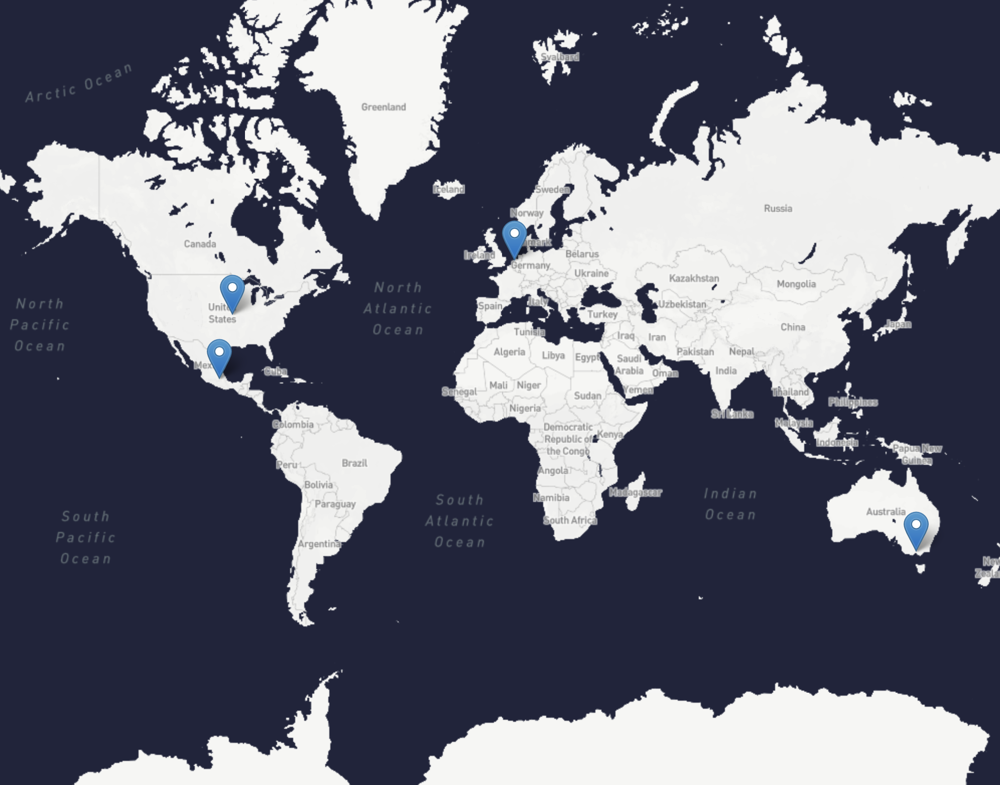
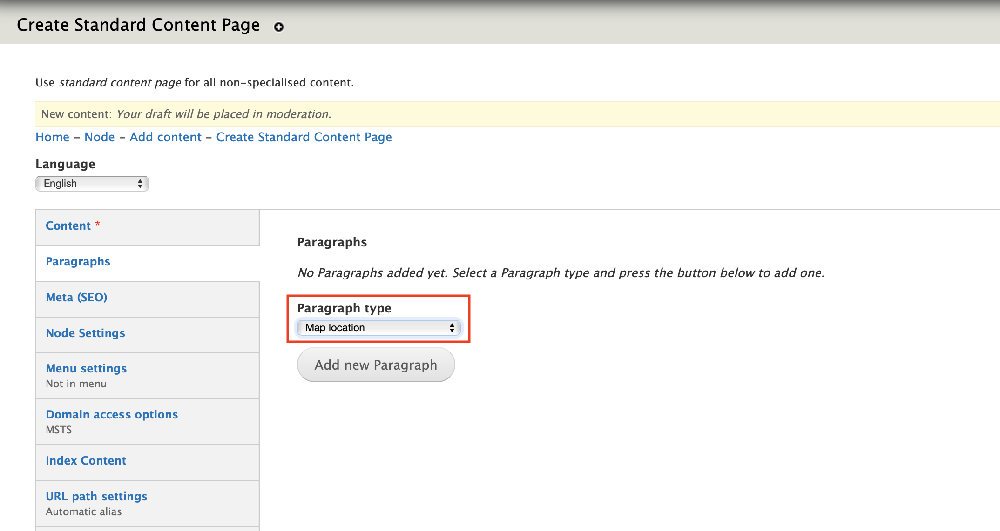
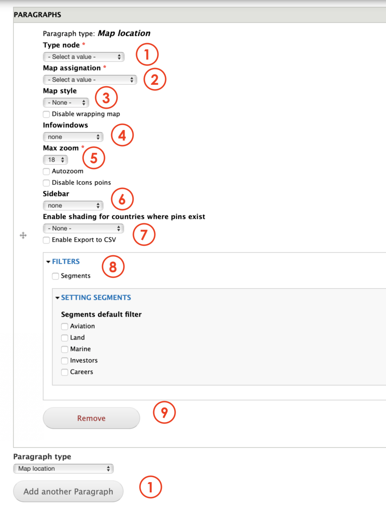

# Map location

**Map Location** paragraph allows Editors create a Map view in a page. 

**Map Location** paragraph takes the content out of  [Map Location Content ](../content-types-1/map-location.md)type. This means that in order to create the paragraph we recommed to create the Map Location content type first. 

## Content types 

This paragraph can be used within the following content types:

* Standard content page

Currently you can see this paragraph used within MSTS site homepage here: [https://www.msts.com​](https://www.msts.com/en/contact-us-msts)

## Step-by-step guide 

To create a **Map Location** Paragraph, select **Content** =&gt; **Add Content** =&gt; **Standard Content Page** \(or any other content type that includes this paragraph \).

Once in Standard Content Page form, select **Map Location** from the dropdown menu and then, click on **Add new Paragraph:**

**Map Location** paragraph form should look like this:

1. **Type node:** you can choose from: Products and Services, Customer Type or Location pins. By choosig location pins, you'll get to see the pointer matiching its location over the map. 
2. **Map Assignation**: select from the drop down menu the category previosly created.
3. **Map Style**: choose from Black, Bright, Style, Newsfeed or WFS tile. This last one is the theme that in use at the moment. 
4. **Infowindows**: allow Editors to enable or disable the feature that allows pointer to display more information when clicking on them. 
5. **Max zoom**: lets Editors to customize the zoom effect. 18 is the one that is being used at this moment. 
6. **Sidebar**: allows Editors to enable or disable the feature to displat a sidebar where more contact information is displayed. 
7. **Enable shading**: this feature allows Editors to decide if they want to highlight the state, country or regions where the pin is located.  
8. **Filters**: let Editors to add filters narrowing the search by segments that have being previously created. 
9. **Remove:** click on _Remove_ to erase the paragraph.
10. **Paragraph type**: you can select another paragraph from the dropdown menu that will be displayed below the **Map Location** paragraph. Click _add_ to create.

