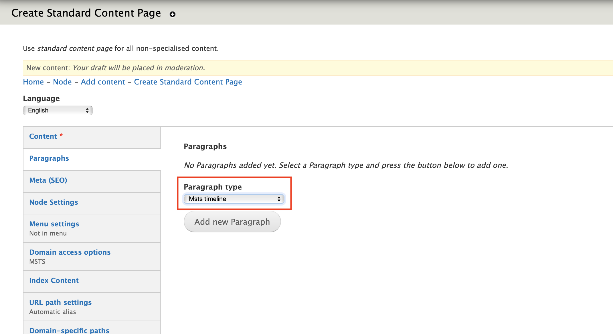
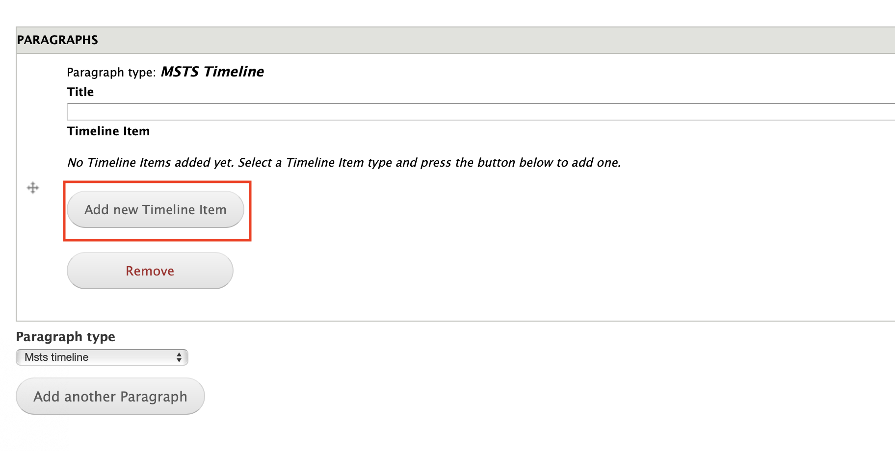
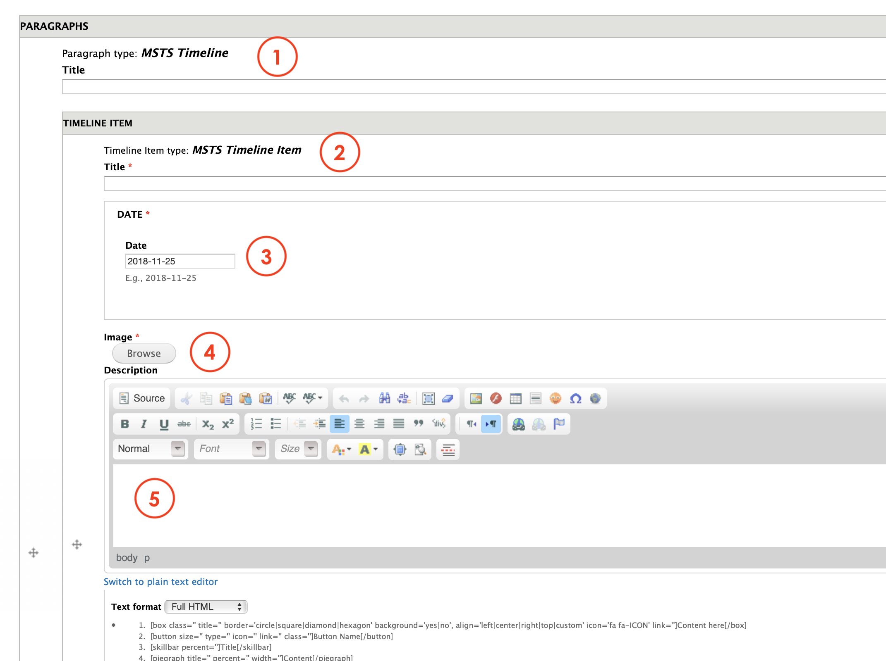
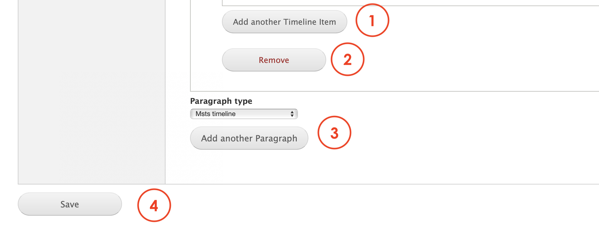

# MSTS timeline

**MSTS timeline** paragraph allows Editors to create an infographic to showcase milestone or important facts that have positively impacted the company's history. 

## Content types

This paragraph can be used within the following content types:

* Standard content page

Currently you can see this paragraph used within MSTS site homepage here: [**https://www.msts.com**](https://www.msts.com/en/our-innovation-story)\*\*\*\*

## Step-by-step guide 

To create a **MSTS Timeline** Paragraph, select **Content** =&gt; **Add Content** =&gt; **Standard Content Page** \(or any other content type that includes this paragraph \).

Once in Standard Content Page form, select **MSTS Timeline** from the dropdown menu and then, click on **Add new Paragraph:**

\*\*\*\*

**MSTS Timeline** paragraph's form should look like this:

Now, click on **Add new Timelime item**. This allows Editors to add a many items they want in the Timeline.

The MSTS Timeline's item should look like this: 

1. **Title**: is the paragraph's title that will be on top of the items and visible for users. 
2. **Title:** add a title for the item.
3. **Date:** set the date you want to be displayed on the layout. 
4. **Image:** upload an image that will be displayed on the timeline. This can be a logo or a person's portrait. 
5. **Description**: here's where the Editors can add the content, description or short story to resume the milestone.

Scroll down until the bottom of the page and continue:

1. **Add another Timeline item**: allows Editors to add a new item. You can add as much as you want.
2. **Remove**: by pressing remove, the paragraph you have created will be deleted. 
3. **Paragraph type**: you can select another paragraph from the dropdown menu that will be displayed below the Content quote paragraph. Once selected, press on **Add another paragraph** to add it.
4. **Save**: Now, all you have to do is to save and preview changes or save for review. 

