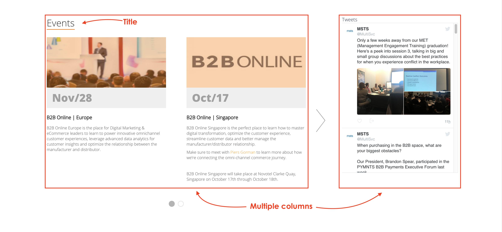
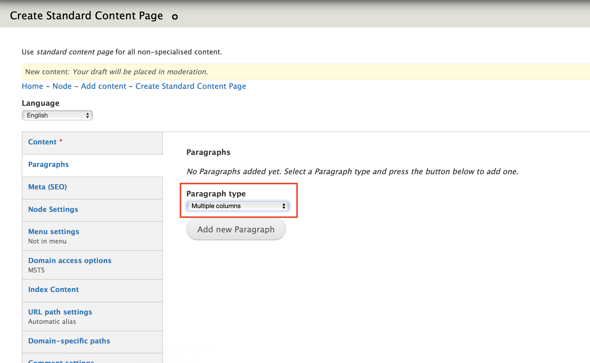
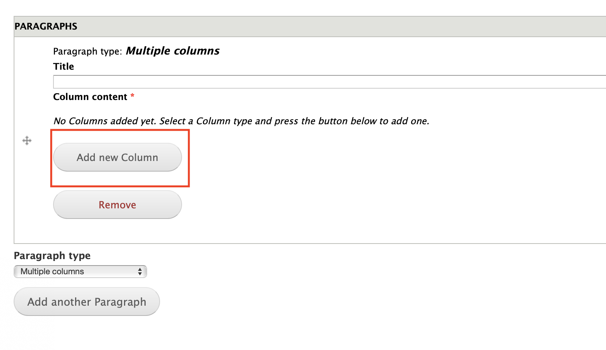
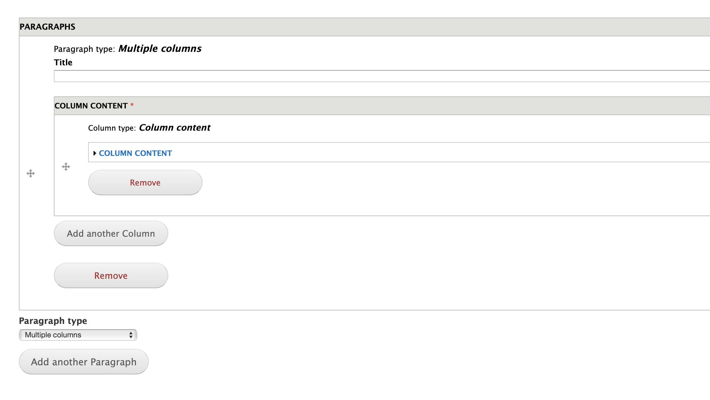
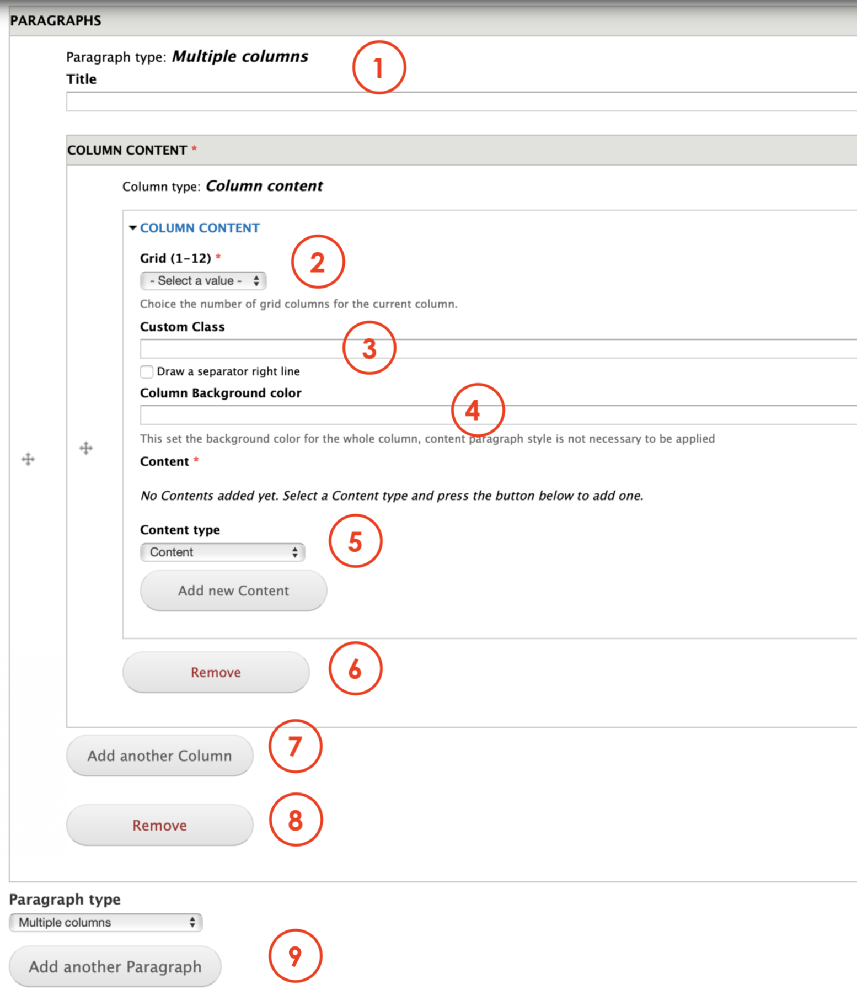

# Multiple columns

**Multiple Columns** allow Editors split the page's width into columns with a customizable size and content. 

Nested in the Multiple Columns we find Column Contents. The content we display in these columns are taken from the Content types that support this view. 

## **Content types**

This paragraph can be used within the following content types:

* Standard content page

## **Step-by-step guide**

To create a **Multiple Columns** Paragraph, select **Content**=&gt; **Add Content**=&gt; **Standard Content Page** \(or any other content type that includes this paragraph \).

Once in the Standard Content Page form, select **Multiple Columns** from the dropdown menu and then, click on **Add new Paragraph:**

Now that the paragraph has been created, click on **Add new Column** to call the content these columns will showcase. 

**Now,** you'll see a form to call the content that you want to display. 

**Open,** the tab Column Content. The form should look like this:

1. **Title**: add a title for the entire parapragh. 
2. **Grid**: allows Editors to customize the column width. 100% is 12 value, so a 8 value would be equal to two thirds the page's width. 
3. **Custom** **class**: pending. 
4. **Column** **background** **color**: allows Editors to customize the background color.
5. **Content** **type**: here's where Editors can choose the type of content that they wish to be displayed on the column. Once selected, click on **Add New content.**
6. **Remove:** click on Remove to erase the Column.
7. **Add another column:** allows Editors to add a new column. If you previously created an 8 value column, you can create a new one with a 4 value, so both can fit the 12 value equal to 100%.
8. **Remove:** click on Remove to erase the paragraph.
9. **Paragraph type**: you can select another paragraph from the dropdown menu that will be displayed below the Content quote paragraph. Click add to create. 

Remember to save and preview changes or save for review.

