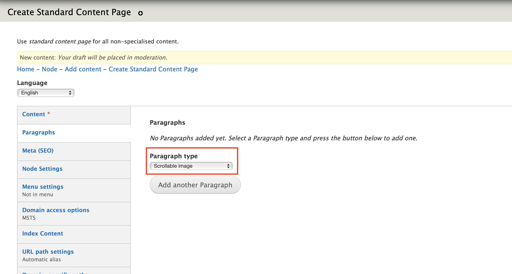
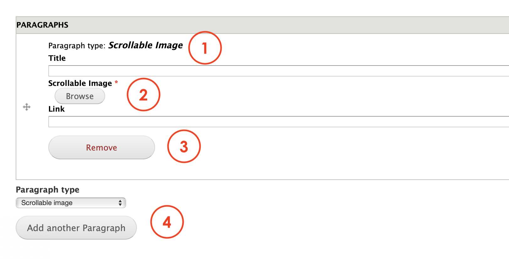

# Scrollable images

**Scrollable images** is a parapraph that allows Editors to display a larger image with an horizontal scrolling effect. This is oftenly use to represent a timeline, chronological events or features. 

The paragraph will automatically put the scroll controls \(arrows\) when the image selected is larger than the page's width. 

## **Content types**

This paragraph can be used within the following content types:

* Standard content page

## **Step-by-step guide**

To create a **Scrollable images** Paragraph, select **Content**=&gt; **Add Content**=&gt; **Standard Content Page** \(or any other content type that includes this paragraph \).

Once in the Standard Content Page form, select **Scrollable images** from the dropdown menu and then, click on **Add new Paragraph:**

You'll see a form like this below:

1. **Title**: add a title for the paragraph that will be visible to users. 
2. **Scrollable** **Image**: select the image you want to publish from your PC, internet or the ones available on the website. Add a link if needed to take users to any other internal or external page. 
3. **Remove:** click on Remove to erase the paragraph.
4. **Paragraph type**: you can select another paragraph from the dropdown menu that will be displayed below the Content quote paragraph. Click add to create.  

   Remember to save and preview changes or save for review.

