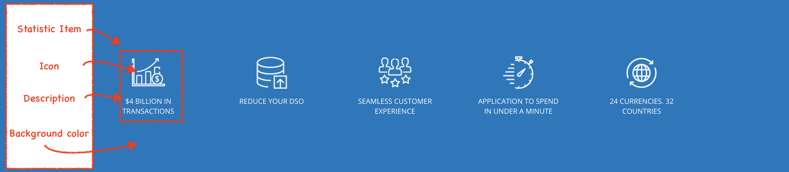
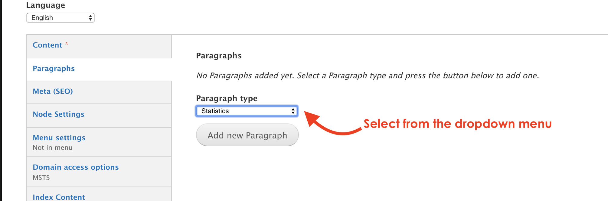
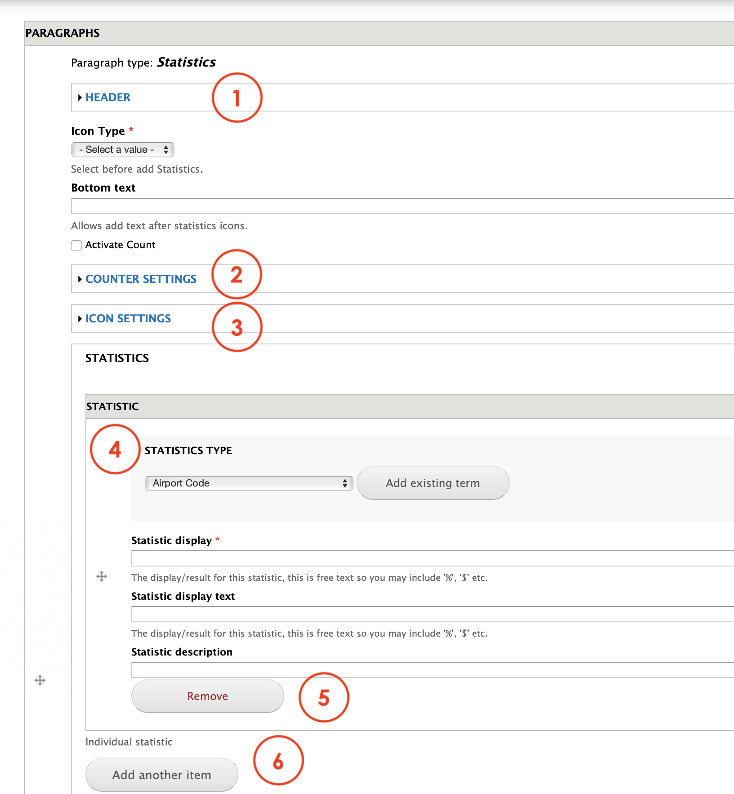
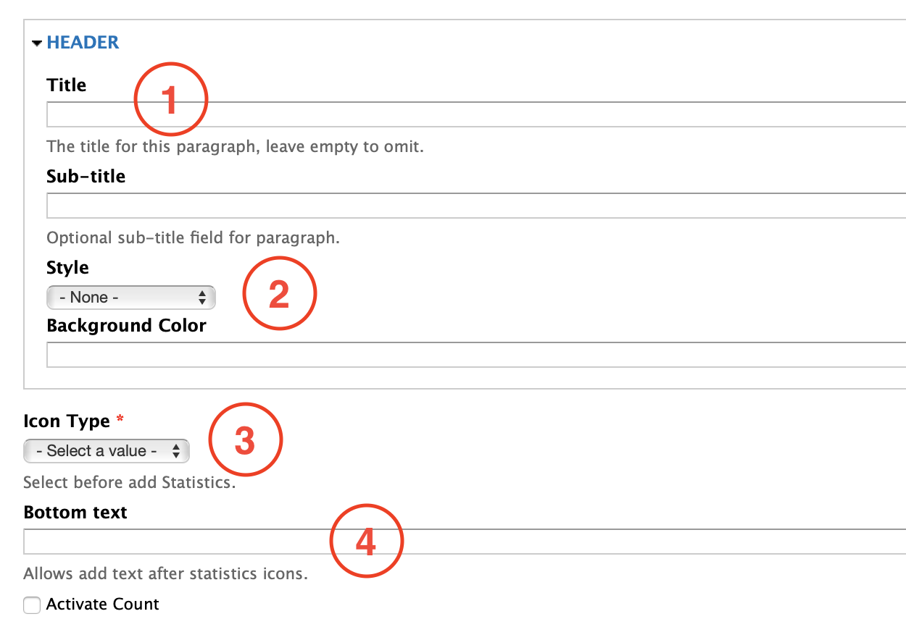
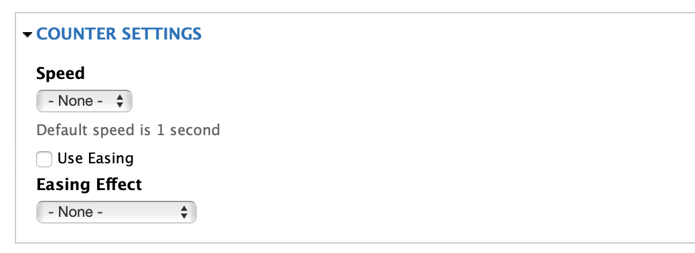
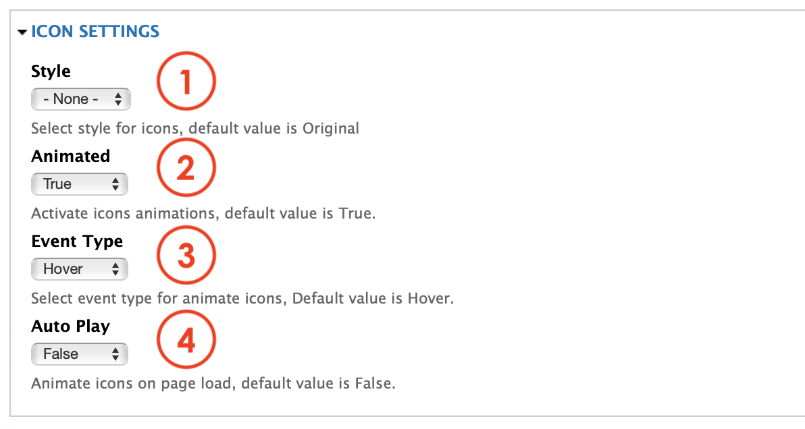
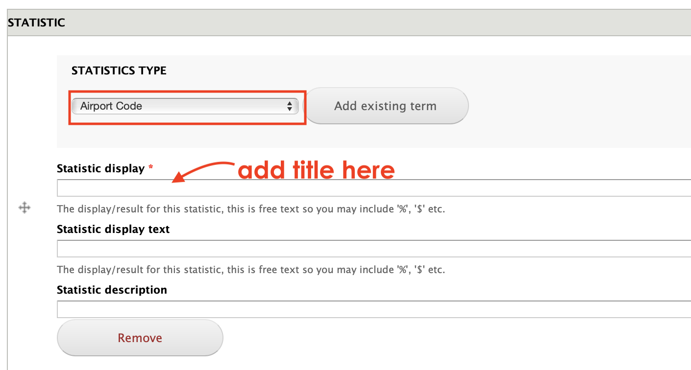

# Statistics

**Statistics paragraph** allows editors to present a series of relevant statistics information in a preset format as shown below:

**Statistics** paragraph features a:

1. Icon
2. Description 
3. Background color

## Content Types 

This paragraph can be used within the following content types:

* Standard content page

Currently you can see this paragraph used within MSTS site homepage here: https://www.msts.com

## Step-by-step guide 

To create a **Statistics** Paragraph, select **Content** =&gt; **Add Content** =&gt; **Standard Content Page**

To add this paragraph, go to **Paragraph tab** and select **Statistics** from the the drop down menu:

You should be able to see a form as the one below. The form is is divided in sections:

1. Header: gathers available features for the paragraph's header.
2. Icon Type: allows Editors to select an icon style or behavior
3. Counter Settings: gathers the available features for the counter effect
4. Icon Settings: allows Editors to customize the icons.
5. Remove: click on Remove to delete this paragraph
6. Add another Item: you can select another paragraph from the dropdown menu that will be displayed below the **Statistics** paragraph

### Header

1. **Title**: allows Editors to add a title for the paragraph that will be visible for the users.
2. **Style**: allows Editors to select from the dropdown different themes or styles for the paragraph.
3. **Icon** **type**: allows Editors to pick an icon type that can be a static image or an animated icon.
4. **Bottom** Text: add text here below the icons block in the paragraph

### Counter settings

Refers to the options available for custimizing the counter feature. 

You can regulate the speed of the animation's transition if you have one. A transition can take up to 5 seconds. 

The Easing Effect lets Editors to choose different styles for the transition's animation like Fadeout, Swing, ease, etc. 

### Icon Settings

1. **Style**: allows Editors to stylish the logo display from the original version. You can add a solid or lines effect for instance.
2. **Animated**: Select True or False to allow pararagraph the ability to display animated icons or not. 
3. **Event** **Type**: lets Editors select if they want the animation to be triggered when hovering overh the icon or not.
4. **Auto** Play: is the feature that allows to trigger the animation when loading the page.

### Statistic Type

In this section you'll be able to select from the dowpdown menu the option for the Statistic Type that are already created as a taxonomy.   

