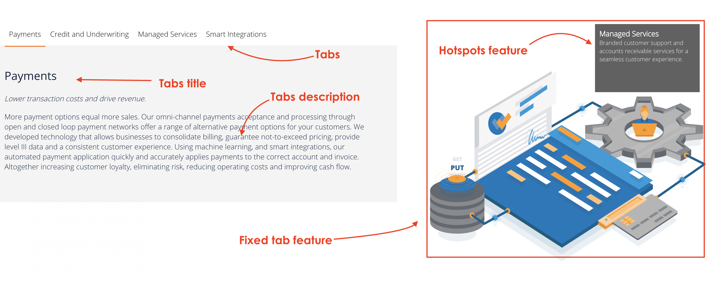
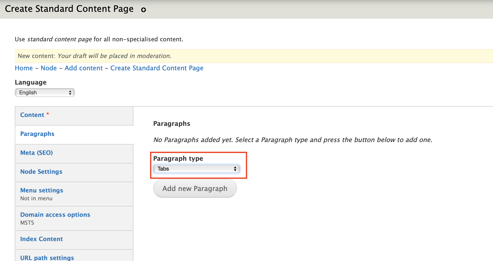
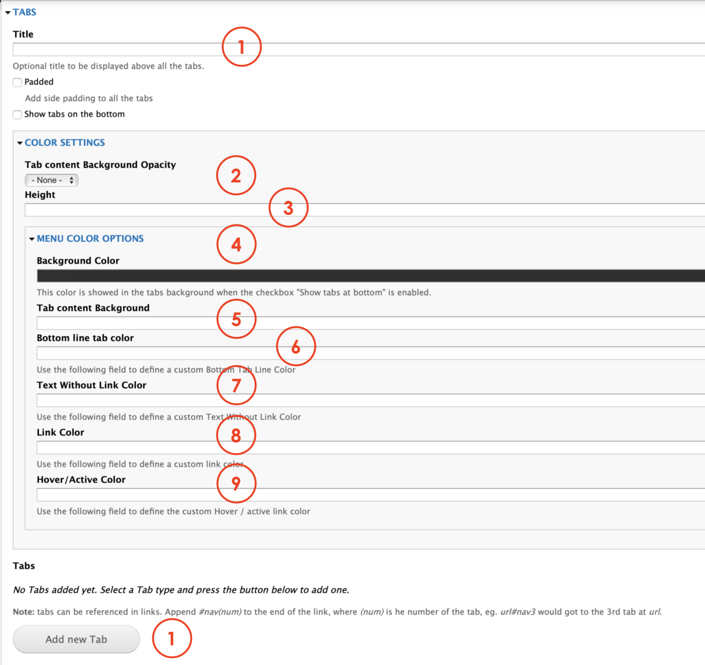

# Tabs

The **Tabs** paragraph allows editors to create a paragraph that manages a lot of information arranged in a tab mode. Users will be able to click on the tabs and get the information related. The pararagraph also has a the 

## Content types 

This paragraph can be used within the following content types:

* Standard content page

Currently you can see this paragraph used within MSTS site homepage here: [https://www.msts.com](https://www.msts.com/en/our-solutions)​

## Step-by-step guide 

To create a **Tabs** Paragraph, select **Content** =&gt; **Add Content** =&gt; **Standard Content Page** \(or any other content type that includes this paragraph \).

Now, you'll get to see the Standard Content Page form. The first thing you will need to do is adding a new paragraph. Select **Tabs** from the dropdown menu and then, click on **Add new Paragraph:**

**Tabs** paragraph form should look like this:

1. **Title**: this is the title that will be displayed at the top of the paragraph. Other options available allow Editors to apply a padding to the Tabs. Select padded to active this option. You can also make the tabs to appear at the bottom of the pararagph by selecting **Show tabs on the bottom**. 
2. **Color** **settings**: Let Editors to set the level of opacity from a range on 0 - 100%. This is the option that allows the background to be faded or solid.
3. **Height**: 
4. **Background** **color**: lets Editors to select the color they want to be used when the option Show tabs at the bottom is enabled. 
5. **Tab content background**: is the option that lets Editors to select from the color picker the tone they want put as a background for the tabs. 
6. **Bottom line tab color**: lets Editors to set the color they want to use for the line that appear below a tab when it's active. 
7. **Text without a Link color**: 
8. **Link color**: set the color for a link. 
9. **Hover/Active color**: lets the Editors to use the color picker to set a color that will be visible for Users when they hover over a tab.
10. **Add new Tab**: is the option that allows Editors to add more tabs to the paragraph. Each tab is created separately, so you'll need to repeat this option for every tab you wish to add to the paragraph. 

