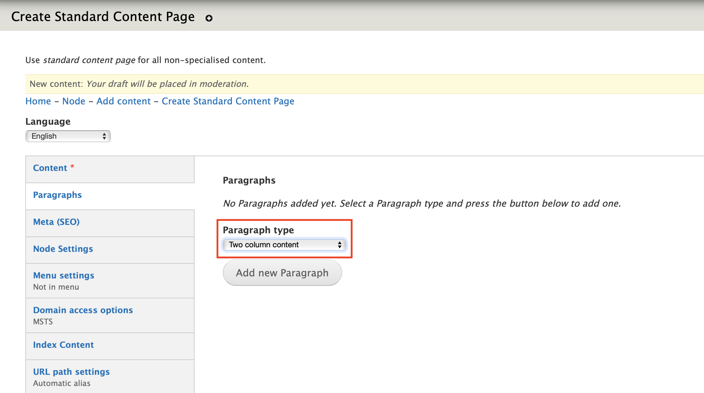
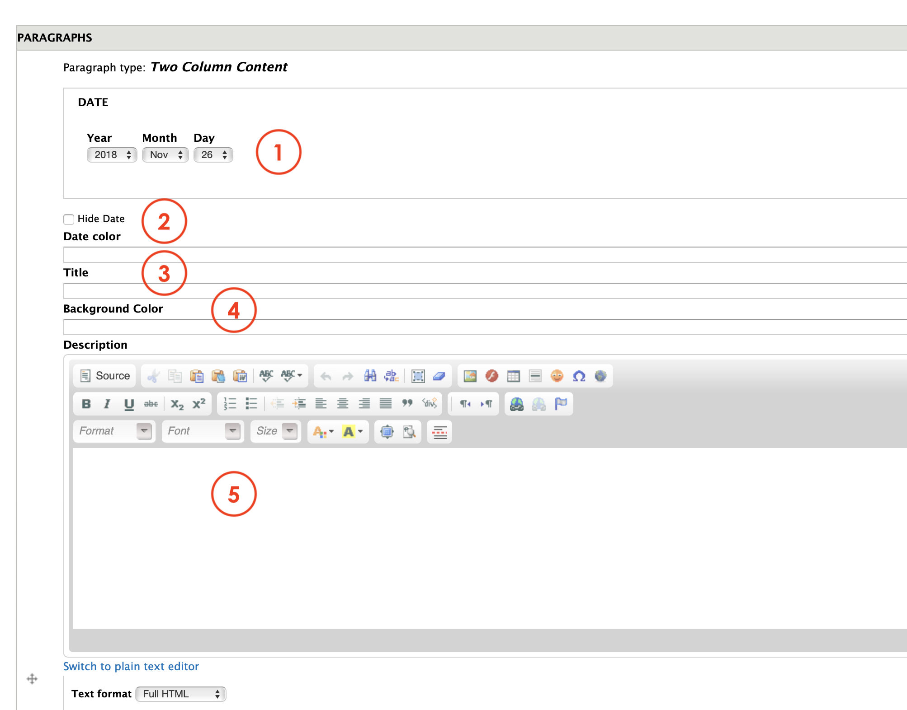
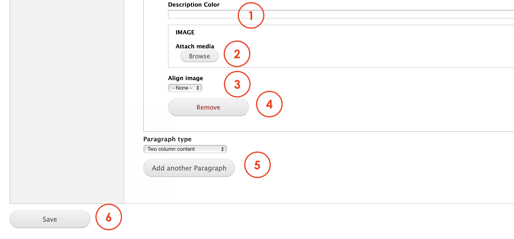

# Two column content

**Two column content** is a paragraph that allows Editors to create a piece of content with a two columns view, one for an image and the other for text. The text features:

1. A date  \(on top with a background color\)
2. A title
3. A description

## Content Types 

This paragraph can be used within the following content types:

* Standard content page

Currently you can see this paragraph used within MSTS site here: [https://www.msts.com](https://www.msts.com/en/community)

## Step-by-step guide 

To create a **Two columns** Paragraph, select **Content** =&gt; **Add Content** =&gt; **Standard Content Page**

To add this paragraph, go to **Paragraph tab** and select **Two Column content** from the the drop down menu:

You should be able to see a form as the one below:

1. **Date**: select the date you want to be displayed on the paragraph
2. **Hide** **date**: check on **Hide** if you don't want the date to be shown in the paragraph
3. **Title:** this is the title that will appear as the paragraph title. 
4. **Background color**: lets Editors to choose the background color with the color picker. 
5. **Description**: add a description text that will appear below the title. 

1. **Description color**: lets Editors to pick the color they want to use for the description font. 
2. **Image**: lets Editors to choose the image they want to be used for this paragraph. 
3. **Align Image**: allows to choose the alignment, whether right, left or middle.
4. **Remove**: click on Remove to delete this paragraph
5. **Add another Item**: you can select another paragraph from the dropdown menu that will be displayed below the **Statistics** paragraph
6. **Save**: press save to draft, to review or to publish. 

### 

